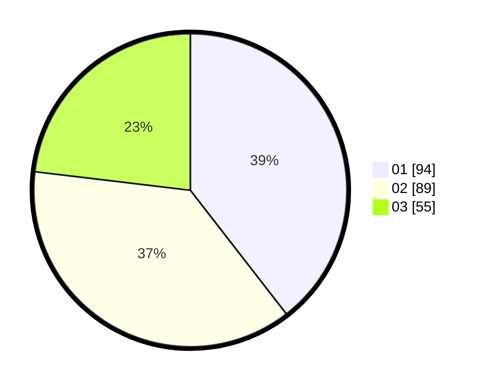

# Hasil

Hasil perolehan suara paslon dapat dilihat pada file paslon-01.txt, paslon-02.txt, dan paslon-03.txt.

Jika tidak ada, artinya data tersebut belum ada pada SIREKAP.

## Perolehan Suara

 * Paslon 01: **94**.
 * Paslon 02: **89**.
 * Paslon 03: **55**.

## Foto C Plano

https://sirekap-obj-formc.kpu.go.id/aa46/pemilu/ppwp/31/75/09/10/02/3175091002080-20240216-173710--a5097699-36ba-49be-a71c-e7ab29db8dc0.jpg

https://sirekap-obj-formc.kpu.go.id/aa46/pemilu/ppwp/31/75/09/10/02/3175091002080-20240216-174331--07eefc81-4cbf-464b-a202-d9bb2b4ef806.jpg

https://sirekap-obj-formc.kpu.go.id/aa46/pemilu/ppwp/31/75/09/10/02/3175091002080-20240216-174718--ad65e612-2f17-494f-9b77-3492475edc7f.jpg

## DATA PEMILIH TETAP

Jumlah pemilih dalam DPT: **283**.
 * L: **133**.
 * P: **150**.

## DATA PENGGUNA HAK PILIH

Jumlah pengguna hak pilih dalam DPT: **236**.
 * L: **106**.
 * P: **130**.

Jumlah pengguna hak pilih dalam DPTb: **6**.
 * L: **3**.
 * P: **3**.

Jumlah pengguna hak pilih dalam DPK: **1**.
 * L: **1**.
 * P: **0**.

Jumlah pengguna hak pilih: **243**.
 * L: **110**.
 * P: **133**.

## JUMLAH SUARA SAH DAN TIDAK SAH

JUMLAH SELURUH SUARA SAH: **238**.

JUMLAH SUARA TIDAK SAH: **5**.

JUMLAH SELURUH SUARA SAH DAN SUARA TIDAK SAH: **243**.
