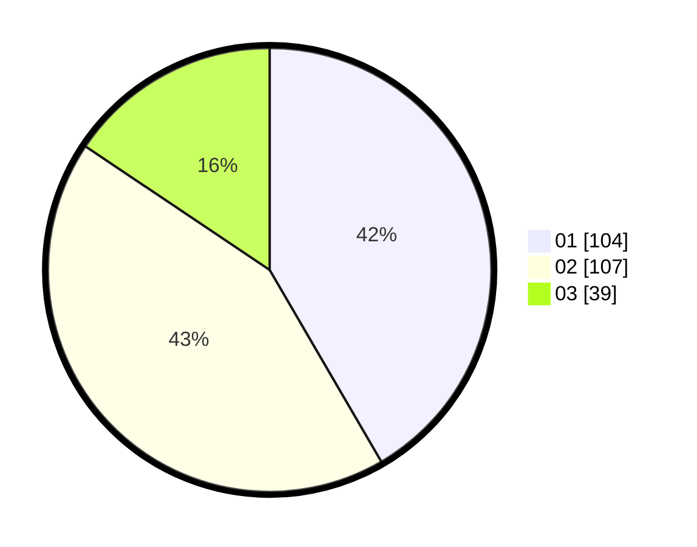

# Hasil

Hasil perolehan suara paslon dapat dilihat pada file paslon-01.txt, paslon-02.txt, dan paslon-03.txt.

Jika tidak ada, artinya data tersebut belum ada pada SIREKAP.

## Perolehan Suara

 * Paslon 01: **104**.
 * Paslon 02: **107**.
 * Paslon 03: **39**.

## Foto C Plano

https://sirekap-obj-formc.kpu.go.id/0ae0/pemilu/ppwp/31/75/09/10/02/3175091002082-20240214-200501--ffbc7be2-e762-41d6-9235-fa316a541e3e.jpg

https://sirekap-obj-formc.kpu.go.id/0ae0/pemilu/ppwp/31/75/09/10/02/3175091002082-20240214-200503--760b73c5-e2e3-40db-812d-095e9fd65331.jpg

https://sirekap-obj-formc.kpu.go.id/0ae0/pemilu/ppwp/31/75/09/10/02/3175091002082-20240214-234437--ce7fc9ff-bc48-4df7-93ff-30b993f0561a.jpg

## DATA PEMILIH TETAP

Jumlah pemilih dalam DPT: **286**.
 * L: **143**.
 * P: **143**.

## DATA PENGGUNA HAK PILIH

Jumlah pengguna hak pilih dalam DPT: **253**.
 * L: **125**.
 * P: **128**.

Jumlah pengguna hak pilih dalam DPTb: **0**.
 * L: **0**.
 * P: **0**.

Jumlah pengguna hak pilih dalam DPK: **2**.
 * L: **1**.
 * P: **1**.

Jumlah pengguna hak pilih: **255**.
 * L: **126**.
 * P: **129**.

## JUMLAH SUARA SAH DAN TIDAK SAH

JUMLAH SELURUH SUARA SAH: **250**.

JUMLAH SUARA TIDAK SAH: **5**.

JUMLAH SELURUH SUARA SAH DAN SUARA TIDAK SAH: **255**.
