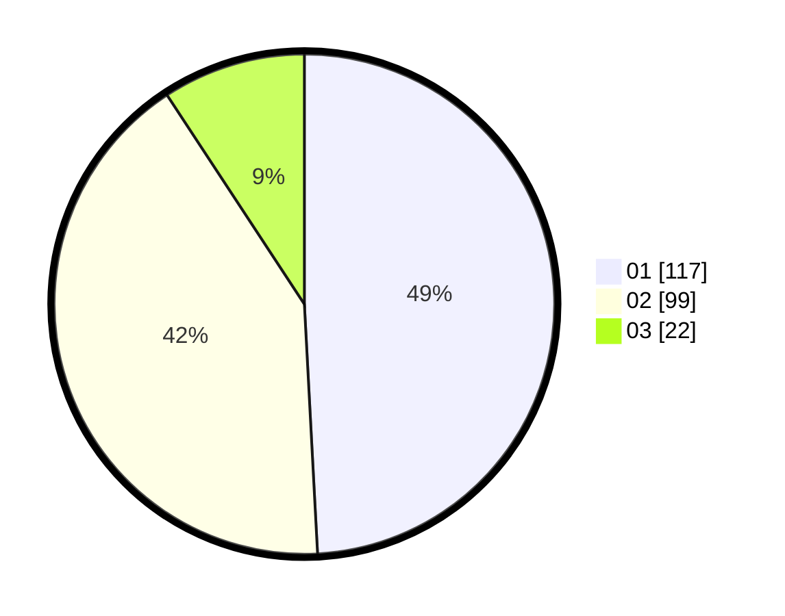

# Hasil

Hasil perolehan suara paslon dapat dilihat pada file paslon-01.txt, paslon-02.txt, dan paslon-03.txt.

Jika tidak ada, artinya data tersebut belum ada pada SIREKAP.

## Perolehan Suara

 * Paslon 01: **117**.
 * Paslon 02: **99**.
 * Paslon 03: **22**.

## Foto C Plano

https://sirekap-obj-formc.kpu.go.id/12d4/pemilu/ppwp/31/75/09/10/02/3175091002085-20240214-210207--c360ef8e-2c25-4853-a85b-bf0dd621eb6a.jpg

https://sirekap-obj-formc.kpu.go.id/12d4/pemilu/ppwp/31/75/09/10/02/3175091002085-20240214-191221--c64bbf40-e694-4bab-82f9-b57b0c7a265f.jpg

https://sirekap-obj-formc.kpu.go.id/12d4/pemilu/ppwp/31/75/09/10/02/3175091002085-20240216-215301--8a7c6529-d13d-4147-af09-2e2bef850a21.jpg

## DATA PEMILIH TETAP

Jumlah pemilih dalam DPT: **278**.
 * L: **138**.
 * P: **140**.

## DATA PENGGUNA HAK PILIH

Jumlah pengguna hak pilih dalam DPT: **232**.
 * L: **108**.
 * P: **124**.

Jumlah pengguna hak pilih dalam DPTb: **13**.
 * L: **5**.
 * P: **8**.

Jumlah pengguna hak pilih dalam DPK: **0**.
 * L: **0**.
 * P: **0**.

Jumlah pengguna hak pilih: **245**.
 * L: **113**.
 * P: **132**.

## JUMLAH SUARA SAH DAN TIDAK SAH

JUMLAH SELURUH SUARA SAH: **238**.

JUMLAH SUARA TIDAK SAH: **7**.

JUMLAH SELURUH SUARA SAH DAN SUARA TIDAK SAH: **245**.
