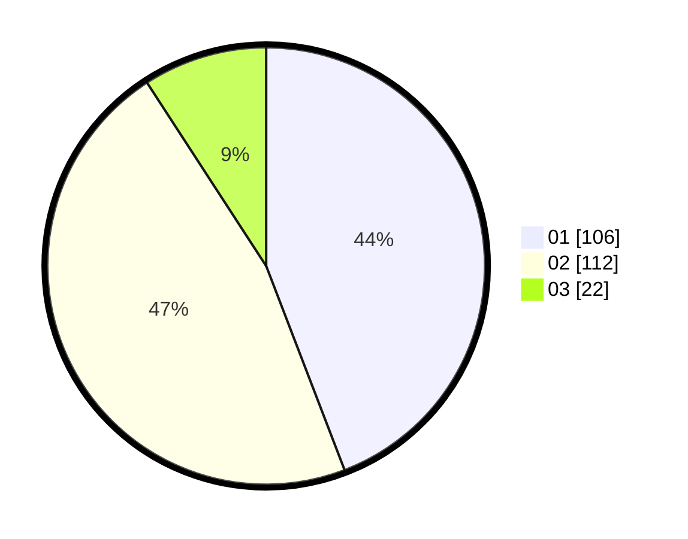

# Hasil

Hasil perolehan suara paslon dapat dilihat pada file paslon-01.txt, paslon-02.txt, dan paslon-03.txt.

Jika tidak ada, artinya data tersebut belum ada pada SIREKAP.

## Perolehan Suara

 * Paslon 01: **106**.
 * Paslon 02: **112**.
 * Paslon 03: **22**.

## Foto C Plano

https://sirekap-obj-formc.kpu.go.id/274a/pemilu/ppwp/31/75/09/10/02/3175091002087-20240214-232139--52a658a9-f6b3-484a-a3a1-daf5f8bd9631.jpg

https://sirekap-obj-formc.kpu.go.id/274a/pemilu/ppwp/31/75/09/10/02/3175091002087-20240214-232157--d33ce898-b302-47ec-a040-2ba2b8ea2edd.jpg

https://sirekap-obj-formc.kpu.go.id/274a/pemilu/ppwp/31/75/09/10/02/3175091002087-20240214-232517--9f601195-9170-4580-bb22-46cab8c98a27.jpg

## DATA PEMILIH TETAP

Jumlah pemilih dalam DPT: **289**.
 * L: **153**.
 * P: **136**.

## DATA PENGGUNA HAK PILIH

Jumlah pengguna hak pilih dalam DPT: **241**.
 * L: **124**.
 * P: **117**.

Jumlah pengguna hak pilih dalam DPTb: **1**.
 * L: **1**.
 * P: **0**.

Jumlah pengguna hak pilih dalam DPK: **3**.
 * L: **2**.
 * P: **1**.

Jumlah pengguna hak pilih: **245**.
 * L: **127**.
 * P: **118**.

## JUMLAH SUARA SAH DAN TIDAK SAH

JUMLAH SELURUH SUARA SAH: **240**.

JUMLAH SUARA TIDAK SAH: **5**.

JUMLAH SELURUH SUARA SAH DAN SUARA TIDAK SAH: **245**.
