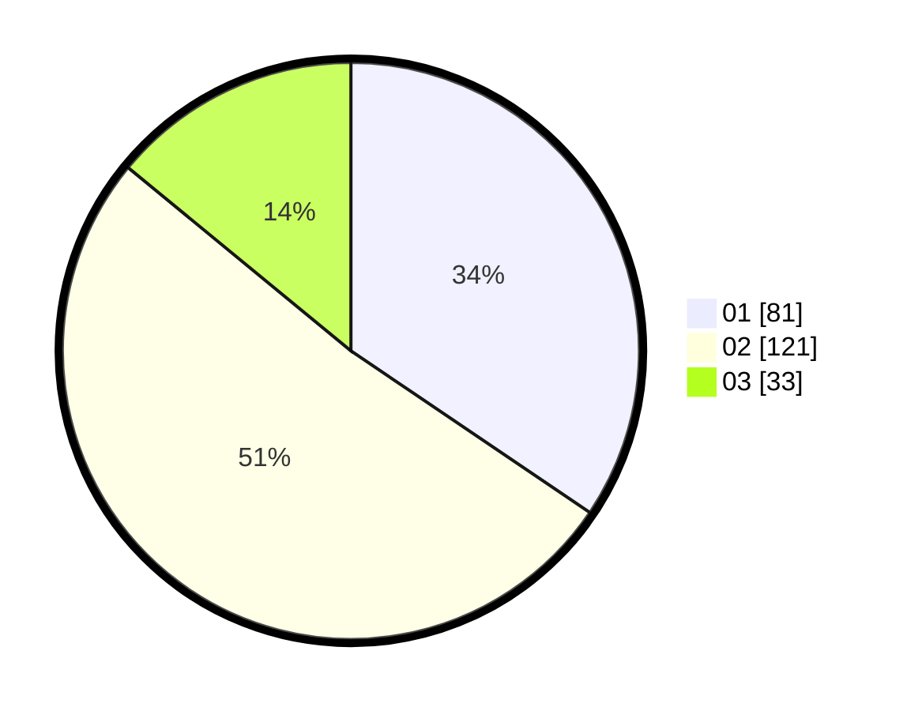

# Hasil

Hasil perolehan suara paslon dapat dilihat pada file paslon-01.txt, paslon-02.txt, dan paslon-03.txt.

Jika tidak ada, artinya data tersebut belum ada pada SIREKAP.

## Perolehan Suara

 * Paslon 01: **81**.
 * Paslon 02: **121**.
 * Paslon 03: **33**.

## Foto C Plano

https://sirekap-obj-formc.kpu.go.id/9ef6/pemilu/ppwp/31/75/09/10/02/3175091002094-20240214-230020--b981bc16-12ef-4267-a0eb-b10824986476.jpg

https://sirekap-obj-formc.kpu.go.id/9ef6/pemilu/ppwp/31/75/09/10/02/3175091002094-20240214-230104--86d96865-1bb3-413c-8150-875fda26dbaf.jpg

https://sirekap-obj-formc.kpu.go.id/9ef6/pemilu/ppwp/31/75/09/10/02/3175091002094-20240214-230145--634413a8-270c-4bde-b391-231c3de4c874.jpg

## DATA PEMILIH TETAP

Jumlah pemilih dalam DPT: **288**.
 * L: **137**.
 * P: **151**.

## DATA PENGGUNA HAK PILIH

Jumlah pengguna hak pilih dalam DPT: **237**.
 * L: **111**.
 * P: **126**.

Jumlah pengguna hak pilih dalam DPTb: **0**.
 * L: **0**.
 * P: **0**.

Jumlah pengguna hak pilih dalam DPK: **0**.
 * L: **0**.
 * P: **0**.

Jumlah pengguna hak pilih: **237**.
 * L: **111**.
 * P: **126**.

## JUMLAH SUARA SAH DAN TIDAK SAH

JUMLAH SELURUH SUARA SAH: **235**.

JUMLAH SUARA TIDAK SAH: **2**.

JUMLAH SELURUH SUARA SAH DAN SUARA TIDAK SAH: **237**.
