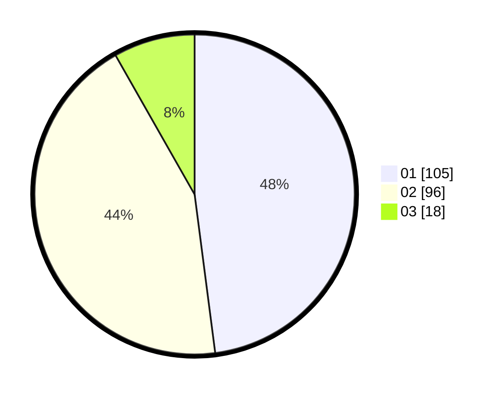

# Hasil

Hasil perolehan suara paslon dapat dilihat pada file paslon-01.txt, paslon-02.txt, dan paslon-03.txt.

Jika tidak ada, artinya data tersebut belum ada pada SIREKAP.

## Perolehan Suara

 * Paslon 01: **105**.
 * Paslon 02: **96**.
 * Paslon 03: **18**.

## Foto C Plano

https://sirekap-obj-formc.kpu.go.id/f7a1/pemilu/ppwp/31/75/09/10/02/3175091002095-20240214-190845--be77c9d8-4903-4745-b485-42a2b940e7dc.jpg

https://sirekap-obj-formc.kpu.go.id/f7a1/pemilu/ppwp/31/75/09/10/02/3175091002095-20240214-191552--a4ea3913-2b04-4ef6-83c1-719453fec499.jpg

https://sirekap-obj-formc.kpu.go.id/f7a1/pemilu/ppwp/31/75/09/10/02/3175091002095-20240214-191920--fa870319-27c7-4faa-8966-ab47f7b91ca0.jpg

## DATA PEMILIH TETAP

Jumlah pemilih dalam DPT: **279**.
 * L: **122**.
 * P: **157**.

## DATA PENGGUNA HAK PILIH

Jumlah pengguna hak pilih dalam DPT: **221**.
 * L: **95**.
 * P: **126**.

Jumlah pengguna hak pilih dalam DPTb: **1**.
 * L: **1**.
 * P: **0**.

Jumlah pengguna hak pilih dalam DPK: **0**.
 * L: **0**.
 * P: **0**.

Jumlah pengguna hak pilih: **222**.
 * L: **96**.
 * P: **126**.

## JUMLAH SUARA SAH DAN TIDAK SAH

JUMLAH SELURUH SUARA SAH: **219**.

JUMLAH SUARA TIDAK SAH: **3**.

JUMLAH SELURUH SUARA SAH DAN SUARA TIDAK SAH: **222**.
