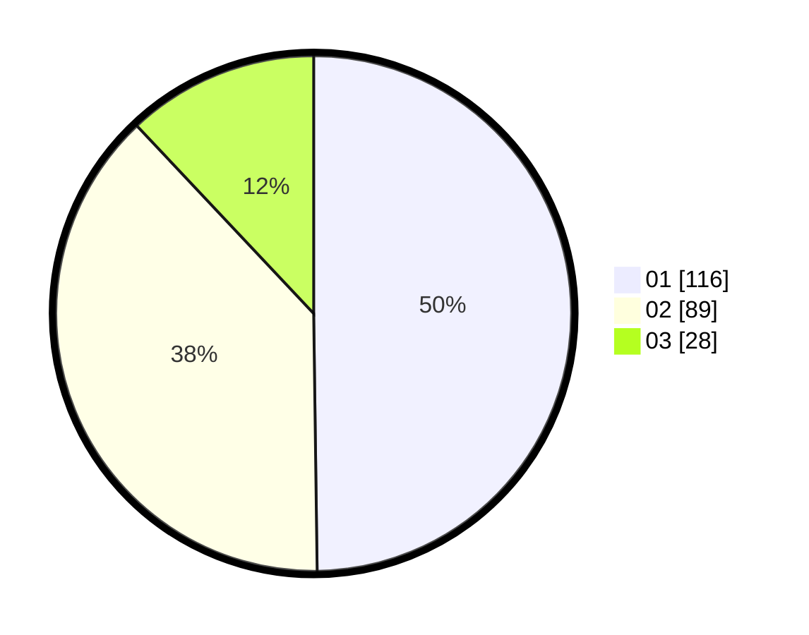

# Hasil

Hasil perolehan suara paslon dapat dilihat pada file paslon-01.txt, paslon-02.txt, dan paslon-03.txt.

Jika tidak ada, artinya data tersebut belum ada pada SIREKAP.

## Perolehan Suara

 * Paslon 01: **116**.
 * Paslon 02: **89**.
 * Paslon 03: **28**.

## Foto C Plano

https://sirekap-obj-formc.kpu.go.id/92e9/pemilu/ppwp/31/75/09/10/02/3175091002096-20240214-191720--f3c1db7a-db40-412a-aff9-6a51c7038d22.jpg

https://sirekap-obj-formc.kpu.go.id/92e9/pemilu/ppwp/31/75/09/10/02/3175091002096-20240214-191836--b0199092-8dc6-449f-92b2-a739777c0602.jpg

https://sirekap-obj-formc.kpu.go.id/92e9/pemilu/ppwp/31/75/09/10/02/3175091002096-20240214-191923--53cc377a-9df4-4b99-ac77-3777ecfb5ae9.jpg

## DATA PEMILIH TETAP

Jumlah pemilih dalam DPT: **283**.
 * L: **145**.
 * P: **138**.

## DATA PENGGUNA HAK PILIH

Jumlah pengguna hak pilih dalam DPT: **231**.
 * L: **118**.
 * P: **113**.

Jumlah pengguna hak pilih dalam DPTb: **4**.
 * L: **3**.
 * P: **1**.

Jumlah pengguna hak pilih dalam DPK: **0**.
 * L: **0**.
 * P: **0**.

Jumlah pengguna hak pilih: **235**.
 * L: **121**.
 * P: **114**.

## JUMLAH SUARA SAH DAN TIDAK SAH

JUMLAH SELURUH SUARA SAH: **223**.

JUMLAH SUARA TIDAK SAH: **2**.

JUMLAH SELURUH SUARA SAH DAN SUARA TIDAK SAH: **235**.
