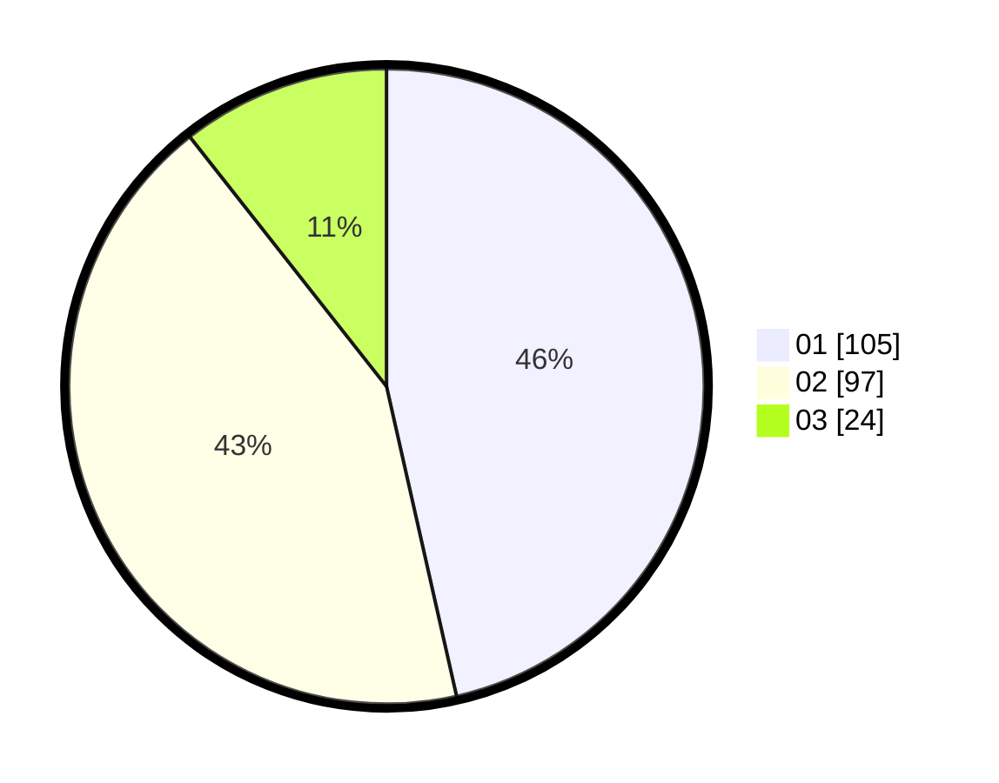

# Hasil

Hasil perolehan suara paslon dapat dilihat pada file paslon-01.txt, paslon-02.txt, dan paslon-03.txt.

Jika tidak ada, artinya data tersebut belum ada pada SIREKAP.

## Perolehan Suara

 * Paslon 01: **105**.
 * Paslon 02: **97**.
 * Paslon 03: **24**.

## Foto C Plano

https://sirekap-obj-formc.kpu.go.id/2c93/pemilu/ppwp/31/75/09/10/02/3175091002097-20240217-153132--d59fbcbe-9956-4b40-bf28-f06828af847c.jpg

https://sirekap-obj-formc.kpu.go.id/2c93/pemilu/ppwp/31/75/09/10/02/3175091002097-20240214-222135--bfdf9eae-d448-488d-abb5-b505c54ac15b.jpg

https://sirekap-obj-formc.kpu.go.id/2c93/pemilu/ppwp/31/75/09/10/02/3175091002097-20240217-153303--394b747d-1983-4c7f-8ec2-aa4ecef450ab.jpg

## DATA PEMILIH TETAP

Jumlah pemilih dalam DPT: **284**.
 * L: **150**.
 * P: **134**.

## DATA PENGGUNA HAK PILIH

Jumlah pengguna hak pilih dalam DPT: **233**.
 * L: **120**.
 * P: **113**.

Jumlah pengguna hak pilih dalam DPTb: **0**.
 * L: **0**.
 * P: **0**.

Jumlah pengguna hak pilih dalam DPK: **0**.
 * L: **0**.
 * P: **0**.

Jumlah pengguna hak pilih: **233**.
 * L: **120**.
 * P: **113**.

## JUMLAH SUARA SAH DAN TIDAK SAH

JUMLAH SELURUH SUARA SAH: **226**.

JUMLAH SUARA TIDAK SAH: **7**.

JUMLAH SELURUH SUARA SAH DAN SUARA TIDAK SAH: **233**.
