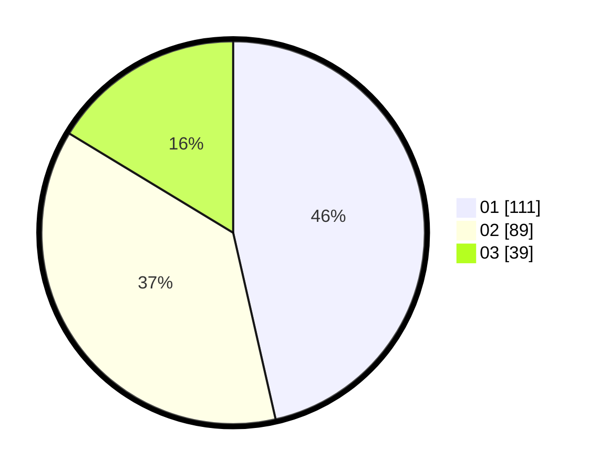

# Hasil

Hasil perolehan suara paslon dapat dilihat pada file paslon-01.txt, paslon-02.txt, dan paslon-03.txt.

Jika tidak ada, artinya data tersebut belum ada pada SIREKAP.

## Perolehan Suara

 * Paslon 01: **111**.
 * Paslon 02: **89**.
 * Paslon 03: **39**.

## Foto C Plano

https://sirekap-obj-formc.kpu.go.id/ec4f/pemilu/ppwp/31/75/09/10/02/3175091002098-20240216-205915--147a8dce-5a50-4897-aa8e-ce8fb72ac5b9.jpg

https://sirekap-obj-formc.kpu.go.id/ec4f/pemilu/ppwp/31/75/09/10/02/3175091002098-20240214-160132--15a3e25b-307c-48b9-975d-01c80a53f13e.jpg

https://sirekap-obj-formc.kpu.go.id/ec4f/pemilu/ppwp/31/75/09/10/02/3175091002098-20240216-211016--b741d4f6-4d6d-4290-9ab2-2c2d37cc5adb.jpg

## DATA PEMILIH TETAP

Jumlah pemilih dalam DPT: **273**.
 * L: **125**.
 * P: **148**.

## DATA PENGGUNA HAK PILIH

Jumlah pengguna hak pilih dalam DPT: **237**.
 * L: **107**.
 * P: **130**.

Jumlah pengguna hak pilih dalam DPTb: **2**.
 * L: **1**.
 * P: **1**.

Jumlah pengguna hak pilih dalam DPK: **1**.
 * L: **0**.
 * P: **1**.

Jumlah pengguna hak pilih: **240**.
 * L: **108**.
 * P: **132**.

## JUMLAH SUARA SAH DAN TIDAK SAH

JUMLAH SELURUH SUARA SAH: **239**.

JUMLAH SUARA TIDAK SAH: **1**.

JUMLAH SELURUH SUARA SAH DAN SUARA TIDAK SAH: **240**.
