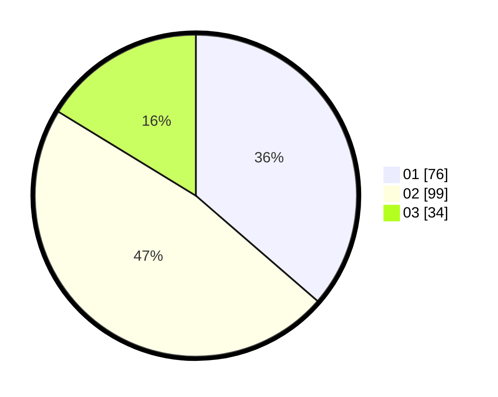

# Hasil

Hasil perolehan suara paslon dapat dilihat pada file paslon-01.txt, paslon-02.txt, dan paslon-03.txt.

Jika tidak ada, artinya data tersebut belum ada pada SIREKAP.

## Perolehan Suara

 * Paslon 01: **76**.
 * Paslon 02: **99**.
 * Paslon 03: **34**.

## Foto C Plano

https://sirekap-obj-formc.kpu.go.id/8bdf/pemilu/ppwp/31/75/09/10/02/3175091002100-20240214-195138--f8cf5c5c-4156-4587-a6ca-c89405aa74bf.jpg

https://sirekap-obj-formc.kpu.go.id/8bdf/pemilu/ppwp/31/75/09/10/02/3175091002100-20240214-195152--a11cc0b5-8b07-49fb-8bd7-ae71cb0b8c81.jpg

https://sirekap-obj-formc.kpu.go.id/8bdf/pemilu/ppwp/31/75/09/10/02/3175091002100-20240214-195206--f7014faf-1532-4b35-9388-faefbaca508e.jpg

## DATA PEMILIH TETAP

Jumlah pemilih dalam DPT: **264**.
 * L: **131**.
 * P: **133**.

## DATA PENGGUNA HAK PILIH

Jumlah pengguna hak pilih dalam DPT: **205**.
 * L: **101**.
 * P: **104**.

Jumlah pengguna hak pilih dalam DPTb: **4**.
 * L: **3**.
 * P: **1**.

Jumlah pengguna hak pilih dalam DPK: **2**.
 * L: **1**.
 * P: **1**.

Jumlah pengguna hak pilih: **211**.
 * L: **105**.
 * P: **106**.

## JUMLAH SUARA SAH DAN TIDAK SAH

JUMLAH SELURUH SUARA SAH: **209**.

JUMLAH SUARA TIDAK SAH: **2**.

JUMLAH SELURUH SUARA SAH DAN SUARA TIDAK SAH: **211**.
