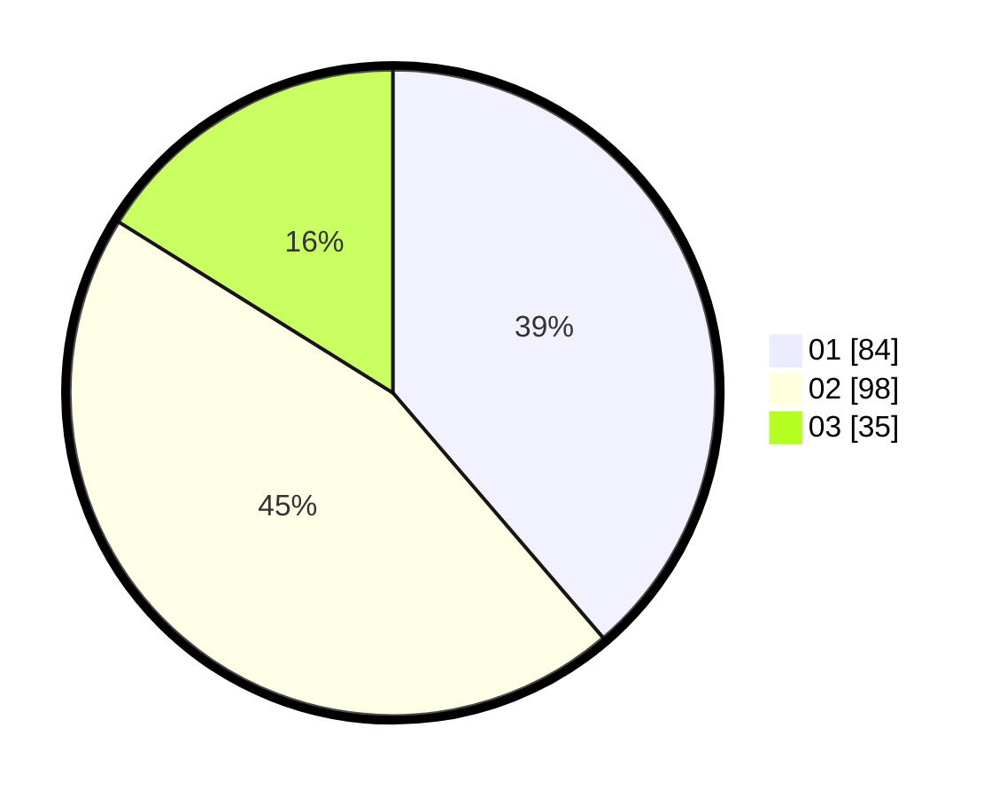

# Hasil

Hasil perolehan suara paslon dapat dilihat pada file paslon-01.txt, paslon-02.txt, dan paslon-03.txt.

Jika tidak ada, artinya data tersebut belum ada pada SIREKAP.

## Perolehan Suara

 * Paslon 01: **84**.
 * Paslon 02: **98**.
 * Paslon 03: **35**.

## Foto C Plano

https://sirekap-obj-formc.kpu.go.id/205e/pemilu/ppwp/31/75/09/10/02/3175091002103-20240214-200425--bc6cd8f5-082c-423a-a655-01049620a09a.jpg

https://sirekap-obj-formc.kpu.go.id/205e/pemilu/ppwp/31/75/09/10/02/3175091002103-20240214-195527--9c7ca2ea-77e7-4619-ae9e-c172bb424fa6.jpg

https://sirekap-obj-formc.kpu.go.id/205e/pemilu/ppwp/31/75/09/10/02/3175091002103-20240214-200802--27751b14-3f79-4089-aa03-d271dfedf7f6.jpg

## DATA PEMILIH TETAP

Jumlah pemilih dalam DPT: **280**.
 * L: **126**.
 * P: **154**.

## DATA PENGGUNA HAK PILIH

Jumlah pengguna hak pilih dalam DPT: **218**.
 * L: **95**.
 * P: **123**.

Jumlah pengguna hak pilih dalam DPTb: **0**.
 * L: **0**.
 * P: **0**.

Jumlah pengguna hak pilih dalam DPK: **3**.
 * L: **0**.
 * P: **3**.

Jumlah pengguna hak pilih: **221**.
 * L: **95**.
 * P: **126**.

## JUMLAH SUARA SAH DAN TIDAK SAH

JUMLAH SELURUH SUARA SAH: **217**.

JUMLAH SUARA TIDAK SAH: **4**.

JUMLAH SELURUH SUARA SAH DAN SUARA TIDAK SAH: **221**.
