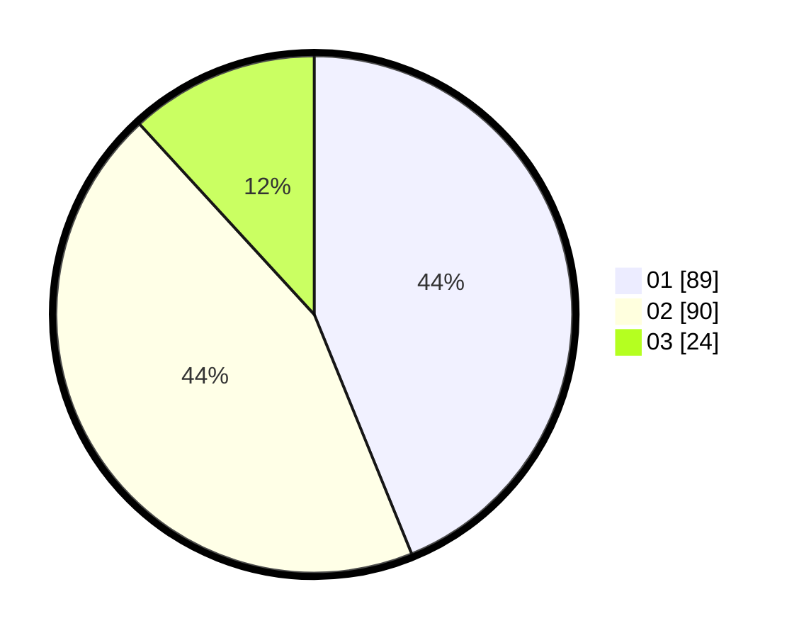

# Hasil

Hasil perolehan suara paslon dapat dilihat pada file paslon-01.txt, paslon-02.txt, dan paslon-03.txt.

Jika tidak ada, artinya data tersebut belum ada pada SIREKAP.

## Perolehan Suara

 * Paslon 01: **89**.
 * Paslon 02: **90**.
 * Paslon 03: **24**.

## Foto C Plano

https://sirekap-obj-formc.kpu.go.id/0b42/pemilu/ppwp/31/75/09/10/02/3175091002107-20240214-191548--950e9cab-0bfa-4009-ab6a-ccfaf7fb0051.jpg

https://sirekap-obj-formc.kpu.go.id/0b42/pemilu/ppwp/31/75/09/10/02/3175091002107-20240214-191728--840cd1a3-a5be-486d-8539-cf362beba70d.jpg

https://sirekap-obj-formc.kpu.go.id/0b42/pemilu/ppwp/31/75/09/10/02/3175091002107-20240214-191833--6e558364-2b80-4045-b71d-3ef4bd310a56.jpg

## DATA PEMILIH TETAP

Jumlah pemilih dalam DPT: **271**.
 * L: **133**.
 * P: **138**.

## DATA PENGGUNA HAK PILIH

Jumlah pengguna hak pilih dalam DPT: **207**.
 * L: **96**.
 * P: **111**.

Jumlah pengguna hak pilih dalam DPTb: **1**.
 * L: **1**.
 * P: **0**.

Jumlah pengguna hak pilih dalam DPK: **1**.
 * L: **1**.
 * P: **0**.

Jumlah pengguna hak pilih: **209**.
 * L: **98**.
 * P: **111**.

## JUMLAH SUARA SAH DAN TIDAK SAH

JUMLAH SELURUH SUARA SAH: **203**.

JUMLAH SUARA TIDAK SAH: **6**.

JUMLAH SELURUH SUARA SAH DAN SUARA TIDAK SAH: **209**.
