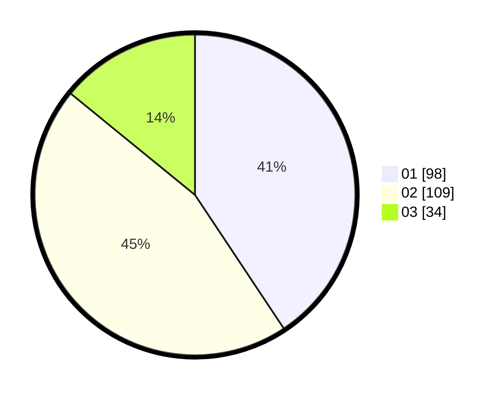

# Hasil

Hasil perolehan suara paslon dapat dilihat pada file paslon-01.txt, paslon-02.txt, dan paslon-03.txt.

Jika tidak ada, artinya data tersebut belum ada pada SIREKAP.

## Perolehan Suara

 * Paslon 01: **98**.
 * Paslon 02: **109**.
 * Paslon 03: **34**.

## Foto C Plano

https://sirekap-obj-formc.kpu.go.id/03f9/pemilu/ppwp/31/75/09/10/02/3175091002110-20240214-192153--8c9fea2f-566f-4158-941e-cfac52e32d3a.jpg

https://sirekap-obj-formc.kpu.go.id/03f9/pemilu/ppwp/31/75/09/10/02/3175091002110-20240214-201620--d5efe939-2f80-4313-b395-29acedd04d14.jpg

https://sirekap-obj-formc.kpu.go.id/03f9/pemilu/ppwp/31/75/09/10/02/3175091002110-20240214-192057--af90073f-f2e9-459b-8843-6555090e1e6d.jpg

## DATA PEMILIH TETAP

Jumlah pemilih dalam DPT: **280**.
 * L: **140**.
 * P: **140**.

## DATA PENGGUNA HAK PILIH

Jumlah pengguna hak pilih dalam DPT: **244**.
 * L: **119**.
 * P: **125**.

Jumlah pengguna hak pilih dalam DPTb: **0**.
 * L: **0**.
 * P: **0**.

Jumlah pengguna hak pilih dalam DPK: **4**.
 * L: **2**.
 * P: **2**.

Jumlah pengguna hak pilih: **248**.
 * L: **121**.
 * P: **127**.

## JUMLAH SUARA SAH DAN TIDAK SAH

JUMLAH SELURUH SUARA SAH: **241**.

JUMLAH SUARA TIDAK SAH: **7**.

JUMLAH SELURUH SUARA SAH DAN SUARA TIDAK SAH: **248**.
