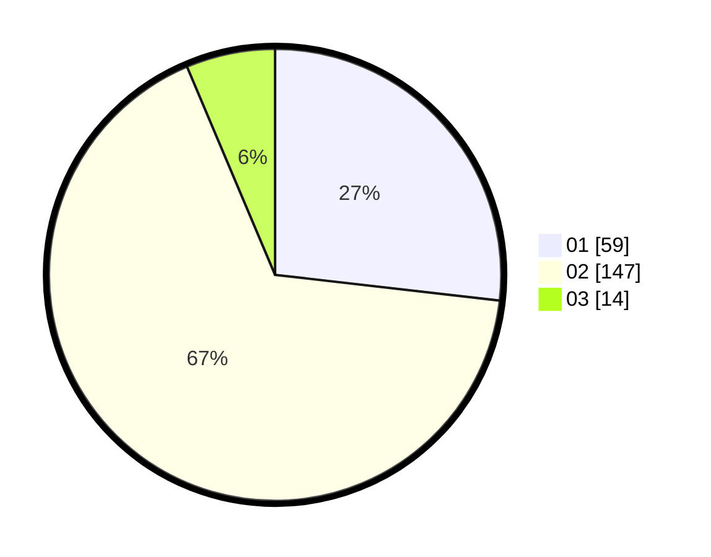

# Hasil

Hasil perolehan suara paslon dapat dilihat pada file paslon-01.txt, paslon-02.txt, dan paslon-03.txt.

Jika tidak ada, artinya data tersebut belum ada pada SIREKAP.

## Perolehan Suara

 * Paslon 01: **59**.
 * Paslon 02: **147**.
 * Paslon 03: **14**.

## Foto C Plano

https://sirekap-obj-formc.kpu.go.id/ac2c/pemilu/ppwp/31/75/09/10/02/3175091002114-20240214-221833--c50db433-3740-484f-bd12-b6c1e995929d.jpg

https://sirekap-obj-formc.kpu.go.id/ac2c/pemilu/ppwp/31/75/09/10/02/3175091002114-20240214-221927--b83da4ef-a44e-4a42-8a28-05176bede161.jpg

https://sirekap-obj-formc.kpu.go.id/ac2c/pemilu/ppwp/31/75/09/10/02/3175091002114-20240214-222042--118c246c-387a-48a0-af3d-9b7773ef3a11.jpg

## DATA PEMILIH TETAP

Jumlah pemilih dalam DPT: **278**.
 * L: **130**.
 * P: **148**.

## DATA PENGGUNA HAK PILIH

Jumlah pengguna hak pilih dalam DPT: **224**.
 * L: **103**.
 * P: **121**.

Jumlah pengguna hak pilih dalam DPTb: **1**.
 * L: **1**.
 * P: **0**.

Jumlah pengguna hak pilih dalam DPK: **0**.
 * L: **0**.
 * P: **0**.

Jumlah pengguna hak pilih: **225**.
 * L: **104**.
 * P: **121**.

## JUMLAH SUARA SAH DAN TIDAK SAH

JUMLAH SELURUH SUARA SAH: **220**.

JUMLAH SUARA TIDAK SAH: **5**.

JUMLAH SELURUH SUARA SAH DAN SUARA TIDAK SAH: **225**.
