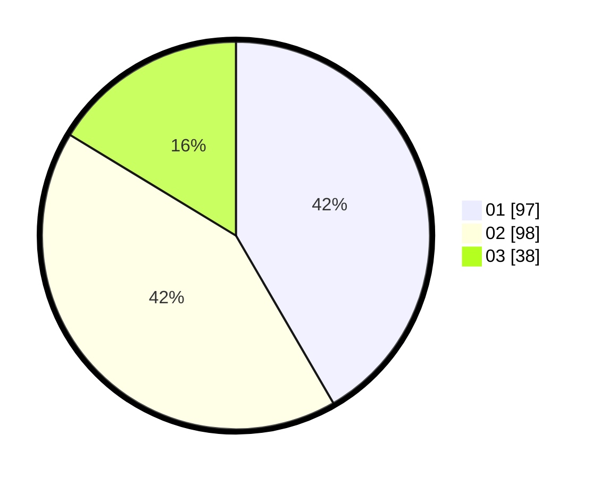

# Hasil

Hasil perolehan suara paslon dapat dilihat pada file paslon-01.txt, paslon-02.txt, dan paslon-03.txt.

Jika tidak ada, artinya data tersebut belum ada pada SIREKAP.

## Perolehan Suara

 * Paslon 01: **97**.
 * Paslon 02: **98**.
 * Paslon 03: **38**.

## Foto C Plano

https://sirekap-obj-formc.kpu.go.id/a38e/pemilu/ppwp/31/75/09/10/02/3175091002116-20240214-200314--5af2edb3-1a4c-46f4-8941-310bbcd0f6d1.jpg

https://sirekap-obj-formc.kpu.go.id/a38e/pemilu/ppwp/31/75/09/10/02/3175091002116-20240214-155609--23565d8d-b70a-43fc-9740-3eef62284f48.jpg

https://sirekap-obj-formc.kpu.go.id/a38e/pemilu/ppwp/31/75/09/10/02/3175091002116-20240214-221217--cc8d8590-2349-4554-aada-9e485ec7aeb8.jpg
