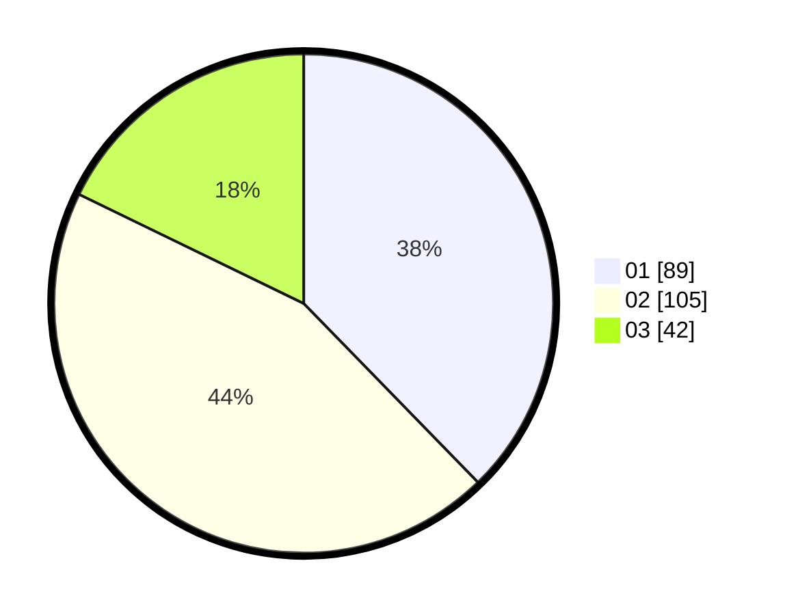

# Hasil

Hasil perolehan suara paslon dapat dilihat pada file paslon-01.txt, paslon-02.txt, dan paslon-03.txt.

Jika tidak ada, artinya data tersebut belum ada pada SIREKAP.

## Perolehan Suara

 * Paslon 01: **89**.
 * Paslon 02: **105**.
 * Paslon 03: **42**.

## Foto C Plano

https://sirekap-obj-formc.kpu.go.id/dd06/pemilu/ppwp/31/75/09/10/02/3175091002118-20240214-203055--e21cd274-181f-4c24-9056-43f8d78642b4.jpg

https://sirekap-obj-formc.kpu.go.id/dd06/pemilu/ppwp/31/75/09/10/02/3175091002118-20240214-203159--cb76aeda-2d5d-4af4-a00a-b39f88a315b8.jpg

https://sirekap-obj-formc.kpu.go.id/dd06/pemilu/ppwp/31/75/09/10/02/3175091002118-20240214-203246--b1b47c42-ae46-449d-8afb-003e90c82ddf.jpg

## DATA PEMILIH TETAP

Jumlah pemilih dalam DPT: **286**.
 * L: **140**.
 * P: **146**.

## DATA PENGGUNA HAK PILIH

Jumlah pengguna hak pilih dalam DPT: **236**.
 * L: **111**.
 * P: **125**.

Jumlah pengguna hak pilih dalam DPTb: **1**.
 * L: **1**.
 * P: **0**.

Jumlah pengguna hak pilih dalam DPK: **1**.
 * L: **0**.
 * P: **1**.

Jumlah pengguna hak pilih: **238**.
 * L: **112**.
 * P: **126**.

## JUMLAH SUARA SAH DAN TIDAK SAH

JUMLAH SELURUH SUARA SAH: **236**.

JUMLAH SUARA TIDAK SAH: **2**.

JUMLAH SELURUH SUARA SAH DAN SUARA TIDAK SAH: **238**.
