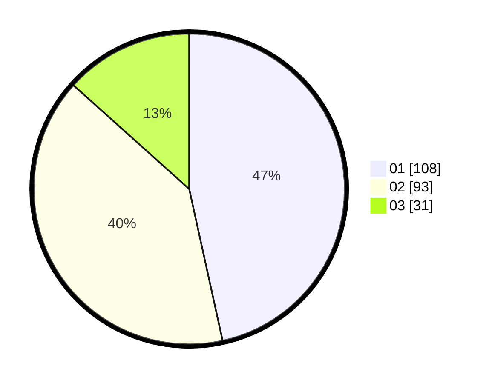

# Hasil

Hasil perolehan suara paslon dapat dilihat pada file paslon-01.txt, paslon-02.txt, dan paslon-03.txt.

Jika tidak ada, artinya data tersebut belum ada pada SIREKAP.

## Perolehan Suara

 * Paslon 01: **108**.
 * Paslon 02: **93**.
 * Paslon 03: **31**.

## Foto C Plano

https://sirekap-obj-formc.kpu.go.id/9ab9/pemilu/ppwp/31/75/09/10/02/3175091002123-20240214-191426--48ac5ab8-d8ed-4893-96c3-bdef10fc630c.jpg

https://sirekap-obj-formc.kpu.go.id/9ab9/pemilu/ppwp/31/75/09/10/02/3175091002123-20240214-191421--7c261e22-d4c4-4d31-9dc8-1c284e710e75.jpg

https://sirekap-obj-formc.kpu.go.id/9ab9/pemilu/ppwp/31/75/09/10/02/3175091002123-20240214-155732--eaba8071-9b53-48fa-9b58-5d2a58f45407.jpg

## DATA PEMILIH TETAP

Jumlah pemilih dalam DPT: **278**.
 * L: **130**.
 * P: **148**.

## DATA PENGGUNA HAK PILIH

Jumlah pengguna hak pilih dalam DPT: **238**.
 * L: **104**.
 * P: **134**.

Jumlah pengguna hak pilih dalam DPTb: **0**.
 * L: **0**.
 * P: **0**.

Jumlah pengguna hak pilih dalam DPK: **0**.
 * L: **0**.
 * P: **0**.

Jumlah pengguna hak pilih: **238**.
 * L: **104**.
 * P: **134**.

## JUMLAH SUARA SAH DAN TIDAK SAH

JUMLAH SELURUH SUARA SAH: **232**.

JUMLAH SUARA TIDAK SAH: **6**.

JUMLAH SELURUH SUARA SAH DAN SUARA TIDAK SAH: **238**.
