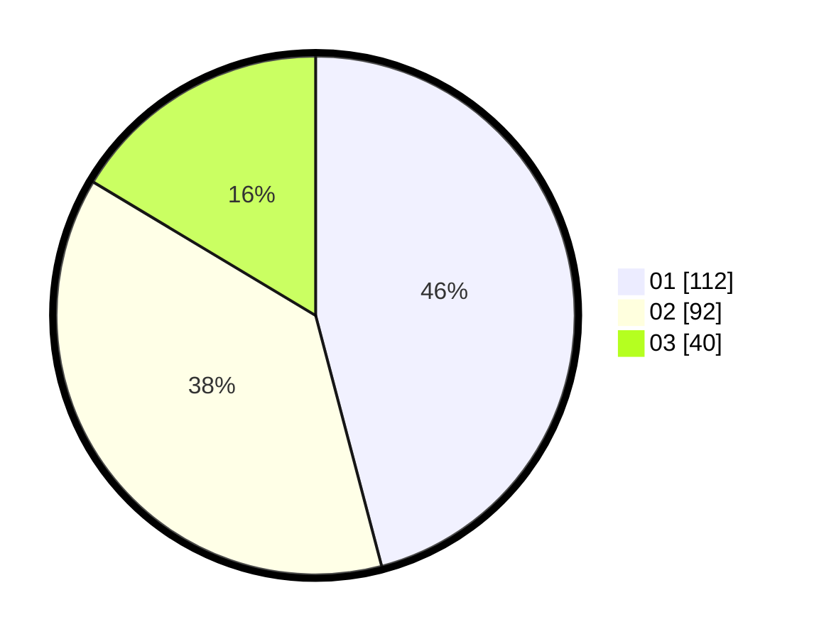

# Hasil

Hasil perolehan suara paslon dapat dilihat pada file paslon-01.txt, paslon-02.txt, dan paslon-03.txt.

Jika tidak ada, artinya data tersebut belum ada pada SIREKAP.

## Perolehan Suara

 * Paslon 01: **112**.
 * Paslon 02: **92**.
 * Paslon 03: **40**.

## Foto C Plano

https://sirekap-obj-formc.kpu.go.id/a988/pemilu/ppwp/31/75/09/10/02/3175091002130-20240214-202544--bbb44d6c-8a85-48af-8654-2a16fa0e687f.jpg

https://sirekap-obj-formc.kpu.go.id/a988/pemilu/ppwp/31/75/09/10/02/3175091002130-20240214-205732--20e72fe7-a4e2-41db-918e-e2303d528f81.jpg

https://sirekap-obj-formc.kpu.go.id/a988/pemilu/ppwp/31/75/09/10/02/3175091002130-20240214-205909--19c02586-d2c3-4267-add9-b85decafb3a8.jpg
