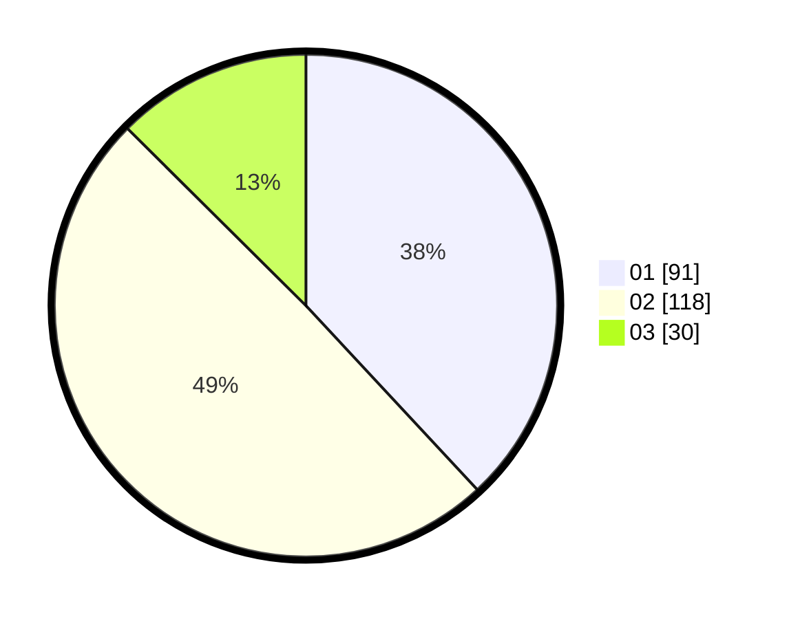

# Hasil

Hasil perolehan suara paslon dapat dilihat pada file paslon-01.txt, paslon-02.txt, dan paslon-03.txt.

Jika tidak ada, artinya data tersebut belum ada pada SIREKAP.

## Perolehan Suara

 * Paslon 01: **91**.
 * Paslon 02: **118**.
 * Paslon 03: **30**.

## Foto C Plano

https://sirekap-obj-formc.kpu.go.id/17fa/pemilu/ppwp/31/75/09/10/02/3175091002131-20240214-205003--ee859967-66ad-41a7-8676-1a8b3be9f232.jpg

https://sirekap-obj-formc.kpu.go.id/17fa/pemilu/ppwp/31/75/09/10/02/3175091002131-20240214-205059--9d10f570-b99f-4d2c-958a-b4661a3971af.jpg

https://sirekap-obj-formc.kpu.go.id/17fa/pemilu/ppwp/31/75/09/10/02/3175091002131-20240214-205204--2f8999ae-595f-4c65-b39e-f218a3f7daab.jpg

## DATA PEMILIH TETAP

Jumlah pemilih dalam DPT: **290**.
 * L: **145**.
 * P: **145**.

## DATA PENGGUNA HAK PILIH

Jumlah pengguna hak pilih dalam DPT: **235**.
 * L: **114**.
 * P: **121**.

Jumlah pengguna hak pilih dalam DPTb: **3**.
 * L: **2**.
 * P: **1**.

Jumlah pengguna hak pilih dalam DPK: **4**.
 * L: **4**.
 * P: **0**.

Jumlah pengguna hak pilih: **242**.
 * L: **120**.
 * P: **122**.

## JUMLAH SUARA SAH DAN TIDAK SAH

JUMLAH SELURUH SUARA SAH: **239**.

JUMLAH SUARA TIDAK SAH: **3**.

JUMLAH SELURUH SUARA SAH DAN SUARA TIDAK SAH: **242**.
