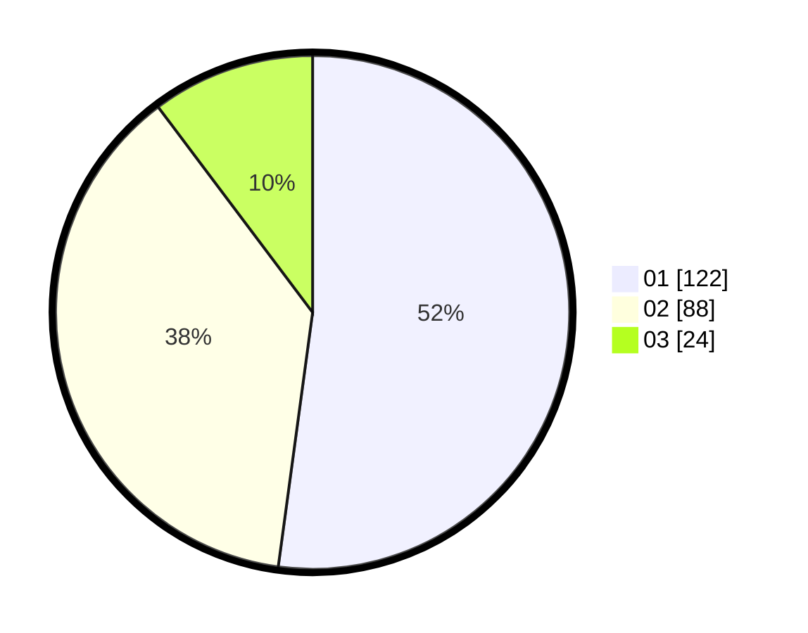

# Hasil

Hasil perolehan suara paslon dapat dilihat pada file paslon-01.txt, paslon-02.txt, dan paslon-03.txt.

Jika tidak ada, artinya data tersebut belum ada pada SIREKAP.

## Perolehan Suara

 * Paslon 01: **122**.
 * Paslon 02: **88**.
 * Paslon 03: **24**.

## Foto C Plano

https://sirekap-obj-formc.kpu.go.id/6294/pemilu/ppwp/31/75/09/10/02/3175091002132-20240214-204459--808f1b4f-ac47-4c79-91e9-44cdbe716d91.jpg

https://sirekap-obj-formc.kpu.go.id/6294/pemilu/ppwp/31/75/09/10/02/3175091002132-20240214-204534--7a5d5159-0e9c-411b-b907-919efa1b9034.jpg

https://sirekap-obj-formc.kpu.go.id/6294/pemilu/ppwp/31/75/09/10/02/3175091002132-20240214-204608--614d1996-b871-45c4-aaa0-abd59d2169ac.jpg

## DATA PEMILIH TETAP

Jumlah pemilih dalam DPT: **277**.
 * L: **132**.
 * P: **145**.

## DATA PENGGUNA HAK PILIH

Jumlah pengguna hak pilih dalam DPT: **233**.
 * L: **112**.
 * P: **121**.

Jumlah pengguna hak pilih dalam DPTb: **1**.
 * L: **1**.
 * P: **0**.

Jumlah pengguna hak pilih dalam DPK: **3**.
 * L: **2**.
 * P: **1**.

Jumlah pengguna hak pilih: **237**.
 * L: **115**.
 * P: **122**.

## JUMLAH SUARA SAH DAN TIDAK SAH

JUMLAH SELURUH SUARA SAH: **234**.

JUMLAH SUARA TIDAK SAH: **3**.

JUMLAH SELURUH SUARA SAH DAN SUARA TIDAK SAH: **237**.
