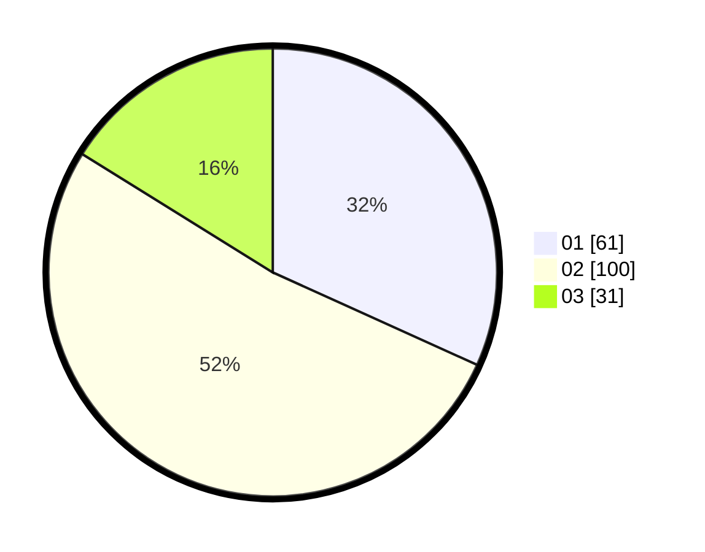

# Hasil

Hasil perolehan suara paslon dapat dilihat pada file paslon-01.txt, paslon-02.txt, dan paslon-03.txt.

Jika tidak ada, artinya data tersebut belum ada pada SIREKAP.

## Perolehan Suara

 * Paslon 01: **61**.
 * Paslon 02: **100**.
 * Paslon 03: **31**.

## Foto C Plano

https://sirekap-obj-formc.kpu.go.id/f480/pemilu/ppwp/31/75/09/10/02/3175091002133-20240215-031003--461e0b3a-71f6-444e-a7e9-39a754e29d10.jpg

https://sirekap-obj-formc.kpu.go.id/f480/pemilu/ppwp/31/75/09/10/02/3175091002133-20240215-031024--e1f47aca-8ce6-4ee9-a605-ddee5bc5f7e0.jpg

https://sirekap-obj-formc.kpu.go.id/f480/pemilu/ppwp/31/75/09/10/02/3175091002133-20240215-031013--fb9211f5-b613-4429-a0f5-b7f40219ffff.jpg

## DATA PEMILIH TETAP

Jumlah pemilih dalam DPT: **248**.
 * L: **117**.
 * P: **131**.

## DATA PENGGUNA HAK PILIH

Jumlah pengguna hak pilih dalam DPT: **194**.
 * L: **83**.
 * P: **111**.

Jumlah pengguna hak pilih dalam DPTb: **0**.
 * L: **0**.
 * P: **0**.

Jumlah pengguna hak pilih dalam DPK: **1**.
 * L: **1**.
 * P: **0**.

Jumlah pengguna hak pilih: **195**.
 * L: **84**.
 * P: **111**.

## JUMLAH SUARA SAH DAN TIDAK SAH

JUMLAH SELURUH SUARA SAH: **192**.

JUMLAH SUARA TIDAK SAH: **3**.

JUMLAH SELURUH SUARA SAH DAN SUARA TIDAK SAH: **195**.
