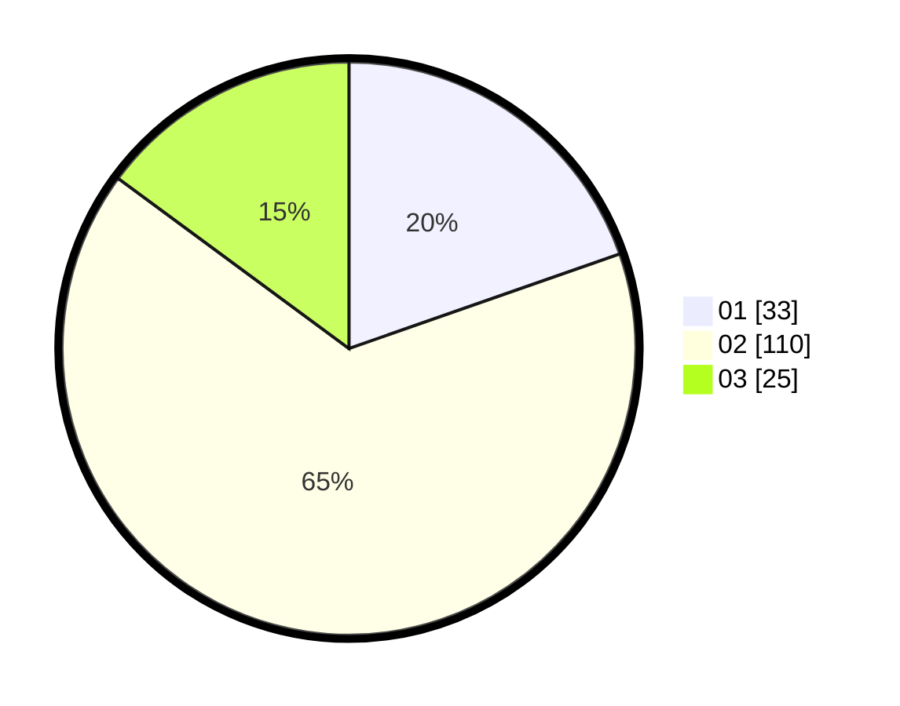

# Hasil

Hasil perolehan suara paslon dapat dilihat pada file paslon-01.txt, paslon-02.txt, dan paslon-03.txt.

Jika tidak ada, artinya data tersebut belum ada pada SIREKAP.

## Perolehan Suara

 * Paslon 01: **33**.
 * Paslon 02: **110**.
 * Paslon 03: **25**.

## Foto C Plano

https://sirekap-obj-formc.kpu.go.id/33b0/pemilu/ppwp/31/75/09/10/02/3175091002136-20240214-191749--52194836-5ebe-4bbe-a805-6b05cbfc20a4.jpg

https://sirekap-obj-formc.kpu.go.id/33b0/pemilu/ppwp/31/75/09/10/02/3175091002136-20240214-195039--7461d508-09ab-4483-8ffc-712f80d48de7.jpg

https://sirekap-obj-formc.kpu.go.id/33b0/pemilu/ppwp/31/75/09/10/02/3175091002136-20240214-191916--971d95f5-71ea-4f2c-ba96-9285d12e7041.jpg

## DATA PEMILIH TETAP

Jumlah pemilih dalam DPT: **251**.
 * L: **123**.
 * P: **128**.

## DATA PENGGUNA HAK PILIH

Jumlah pengguna hak pilih dalam DPT: **218**.
 * L: **104**.
 * P: **114**.

Jumlah pengguna hak pilih dalam DPTb: **0**.
 * L: **0**.
 * P: **0**.

Jumlah pengguna hak pilih dalam DPK: **1**.
 * L: **1**.
 * P: **0**.

Jumlah pengguna hak pilih: **219**.
 * L: **105**.
 * P: **114**.

## JUMLAH SUARA SAH DAN TIDAK SAH

JUMLAH SELURUH SUARA SAH: **218**.

JUMLAH SUARA TIDAK SAH: **1**.

JUMLAH SELURUH SUARA SAH DAN SUARA TIDAK SAH: **219**.
