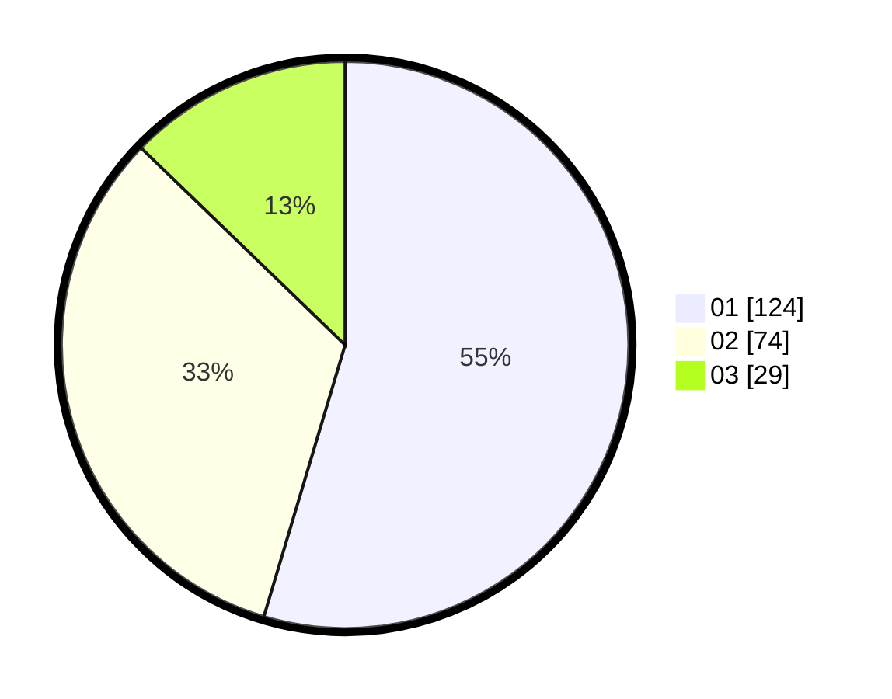

# Hasil

Hasil perolehan suara paslon dapat dilihat pada file paslon-01.txt, paslon-02.txt, dan paslon-03.txt.

Jika tidak ada, artinya data tersebut belum ada pada SIREKAP.

## Perolehan Suara

 * Paslon 01: **124**.
 * Paslon 02: **74**.
 * Paslon 03: **29**.

## Foto C Plano

https://sirekap-obj-formc.kpu.go.id/ea1b/pemilu/ppwp/31/75/09/10/02/3175091002152-20240214-155341--f06023b6-44f0-4a67-a0a5-170aa2a16888.jpg

https://sirekap-obj-formc.kpu.go.id/ea1b/pemilu/ppwp/31/75/09/10/02/3175091002152-20240214-155521--ed95ce37-76d9-4715-b79f-a127fd6dc8db.jpg

https://sirekap-obj-formc.kpu.go.id/ea1b/pemilu/ppwp/31/75/09/10/02/3175091002152-20240214-192434--bee526ee-db48-4de5-af88-df0584aa3634.jpg

## DATA PEMILIH TETAP

Jumlah pemilih dalam DPT: **267**.
 * L: **131**.
 * P: **136**.

## DATA PENGGUNA HAK PILIH

Jumlah pengguna hak pilih dalam DPT: **229**.
 * L: **107**.
 * P: **122**.

Jumlah pengguna hak pilih dalam DPTb: **1**.
 * L: **0**.
 * P: **1**.

Jumlah pengguna hak pilih dalam DPK: **2**.
 * L: **2**.
 * P: **0**.

Jumlah pengguna hak pilih: **232**.
 * L: **109**.
 * P: **123**.

## JUMLAH SUARA SAH DAN TIDAK SAH

JUMLAH SELURUH SUARA SAH: **227**.

JUMLAH SUARA TIDAK SAH: **5**.

JUMLAH SELURUH SUARA SAH DAN SUARA TIDAK SAH: **232**.
