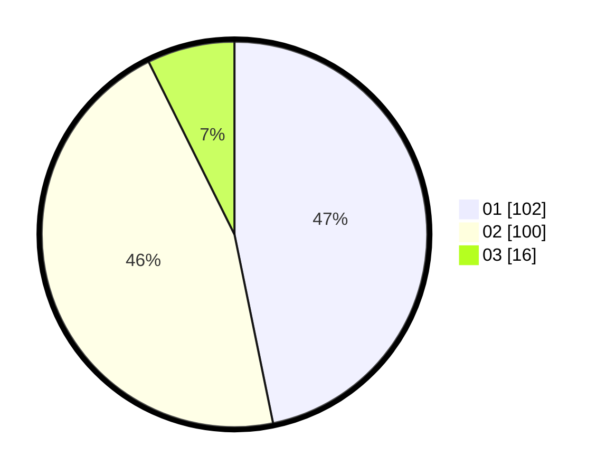

# Hasil

Hasil perolehan suara paslon dapat dilihat pada file paslon-01.txt, paslon-02.txt, dan paslon-03.txt.

Jika tidak ada, artinya data tersebut belum ada pada SIREKAP.

## Perolehan Suara

 * Paslon 01: **102**.
 * Paslon 02: **100**.
 * Paslon 03: **16**.

## Foto C Plano

https://sirekap-obj-formc.kpu.go.id/c461/pemilu/ppwp/31/75/09/10/02/3175091002155-20240214-203305--d3af271e-2107-4607-8659-2b98fb583ab3.jpg

https://sirekap-obj-formc.kpu.go.id/c461/pemilu/ppwp/31/75/09/10/02/3175091002155-20240214-203316--ef4a6344-69ab-4d61-bfcc-92530da09799.jpg

https://sirekap-obj-formc.kpu.go.id/c461/pemilu/ppwp/31/75/09/10/02/3175091002155-20240214-203322--709cead3-3264-4fb3-a1ae-a26d69cba3d1.jpg

## DATA PEMILIH TETAP

Jumlah pemilih dalam DPT: **276**.
 * L: **132**.
 * P: **144**.

## DATA PENGGUNA HAK PILIH

Jumlah pengguna hak pilih dalam DPT: **223**.
 * L: **104**.
 * P: **119**.

Jumlah pengguna hak pilih dalam DPTb: **1**.
 * L: **1**.
 * P: **0**.

Jumlah pengguna hak pilih dalam DPK: **3**.
 * L: **1**.
 * P: **2**.

Jumlah pengguna hak pilih: **227**.
 * L: **106**.
 * P: **121**.

## JUMLAH SUARA SAH DAN TIDAK SAH

JUMLAH SELURUH SUARA SAH: **218**.

JUMLAH SUARA TIDAK SAH: **9**.

JUMLAH SELURUH SUARA SAH DAN SUARA TIDAK SAH: **227**.
