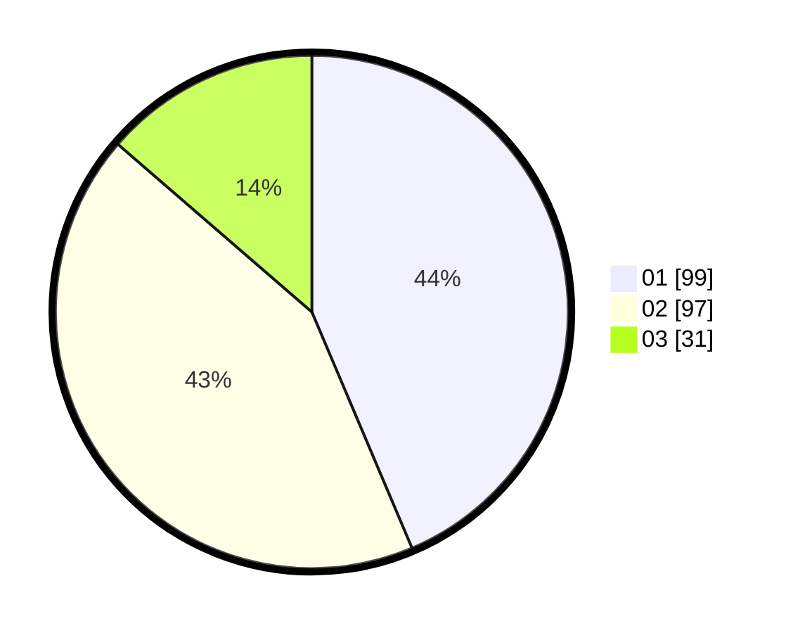

# Hasil

Hasil perolehan suara paslon dapat dilihat pada file paslon-01.txt, paslon-02.txt, dan paslon-03.txt.

Jika tidak ada, artinya data tersebut belum ada pada SIREKAP.

## Perolehan Suara

 * Paslon 01: **99**.
 * Paslon 02: **97**.
 * Paslon 03: **31**.

## Foto C Plano

https://sirekap-obj-formc.kpu.go.id/4d65/pemilu/ppwp/31/75/09/10/02/3175091002159-20240214-211316--4948e2ec-f96d-411f-8cd8-4c76db7d6e34.jpg

https://sirekap-obj-formc.kpu.go.id/4d65/pemilu/ppwp/31/75/09/10/02/3175091002159-20240214-155746--8fba91a4-c9eb-4512-85ff-e7f51d3c91d0.jpg

https://sirekap-obj-formc.kpu.go.id/4d65/pemilu/ppwp/31/75/09/10/02/3175091002159-20240214-155750--20366156-ef71-417f-bd95-5abab84eace0.jpg

## DATA PEMILIH TETAP

Jumlah pemilih dalam DPT: **282**.
 * L: **131**.
 * P: **151**.

## DATA PENGGUNA HAK PILIH

Jumlah pengguna hak pilih dalam DPT: **227**.
 * L: **102**.
 * P: **125**.

Jumlah pengguna hak pilih dalam DPTb: **0**.
 * L: **0**.
 * P: **0**.

Jumlah pengguna hak pilih dalam DPK: **1**.
 * L: **1**.
 * P: **0**.

Jumlah pengguna hak pilih: **228**.
 * L: **103**.
 * P: **125**.

## JUMLAH SUARA SAH DAN TIDAK SAH

JUMLAH SELURUH SUARA SAH: **227**.

JUMLAH SUARA TIDAK SAH: **1**.

JUMLAH SELURUH SUARA SAH DAN SUARA TIDAK SAH: **228**.
