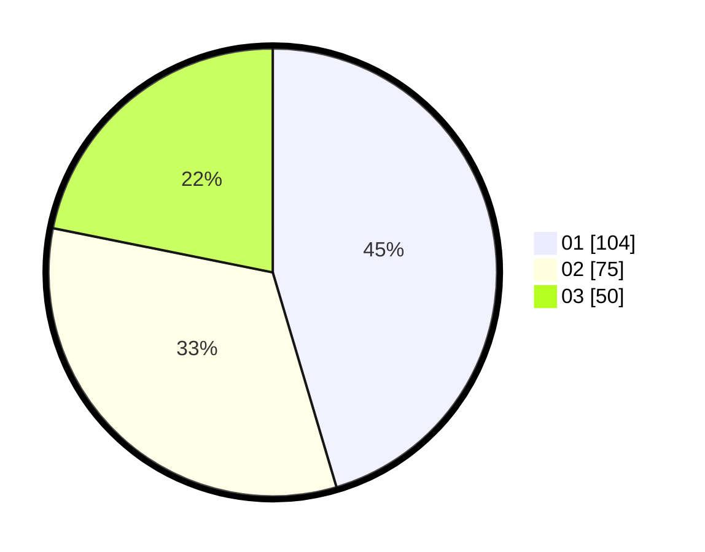

# Hasil

Hasil perolehan suara paslon dapat dilihat pada file paslon-01.txt, paslon-02.txt, dan paslon-03.txt.

Jika tidak ada, artinya data tersebut belum ada pada SIREKAP.

## Perolehan Suara

 * Paslon 01: **104**.
 * Paslon 02: **75**.
 * Paslon 03: **50**.

## Foto C Plano

https://sirekap-obj-formc.kpu.go.id/62a5/pemilu/ppwp/31/75/09/10/02/3175091002162-20240214-192301--7d08db3e-5efd-4c99-8f48-6fc56f647563.jpg

https://sirekap-obj-formc.kpu.go.id/62a5/pemilu/ppwp/31/75/09/10/02/3175091002162-20240214-192314--fb670efe-d290-459e-856b-800ce6acbf76.jpg

https://sirekap-obj-formc.kpu.go.id/62a5/pemilu/ppwp/31/75/09/10/02/3175091002162-20240214-192321--e643afe6-d2ee-456b-aa99-5b1da2767aae.jpg

## DATA PEMILIH TETAP

Jumlah pemilih dalam DPT: **283**.
 * L: **130**.
 * P: **153**.

## DATA PENGGUNA HAK PILIH

Jumlah pengguna hak pilih dalam DPT: **228**.
 * L: **103**.
 * P: **125**.

Jumlah pengguna hak pilih dalam DPTb: **0**.
 * L: **0**.
 * P: **0**.

Jumlah pengguna hak pilih dalam DPK: **2**.
 * L: **1**.
 * P: **1**.

Jumlah pengguna hak pilih: **230**.
 * L: **104**.
 * P: **126**.

## JUMLAH SUARA SAH DAN TIDAK SAH

JUMLAH SELURUH SUARA SAH: **229**.

JUMLAH SUARA TIDAK SAH: **1**.

JUMLAH SELURUH SUARA SAH DAN SUARA TIDAK SAH: **230**.
