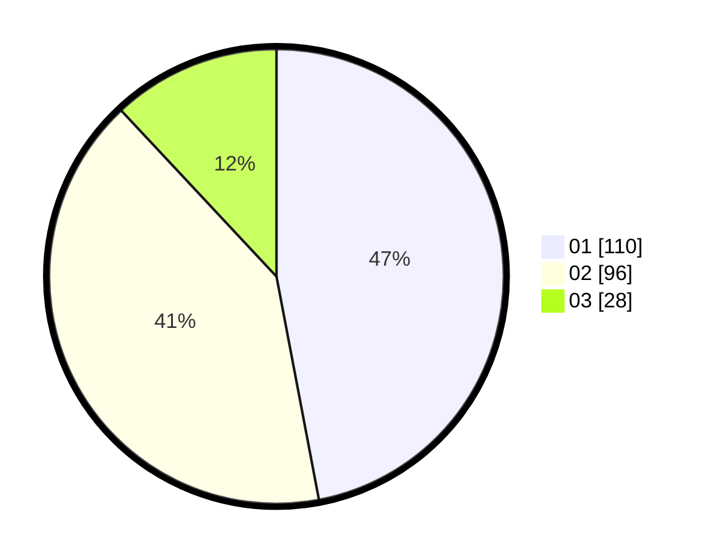

# Hasil

Hasil perolehan suara paslon dapat dilihat pada file paslon-01.txt, paslon-02.txt, dan paslon-03.txt.

Jika tidak ada, artinya data tersebut belum ada pada SIREKAP.

## Perolehan Suara

 * Paslon 01: **110**.
 * Paslon 02: **96**.
 * Paslon 03: **28**.

## Foto C Plano

https://sirekap-obj-formc.kpu.go.id/c327/pemilu/ppwp/31/75/09/10/02/3175091002166-20240214-184643--69113264-a9ba-4d54-b2dc-d43e422826e3.jpg

https://sirekap-obj-formc.kpu.go.id/c327/pemilu/ppwp/31/75/09/10/02/3175091002166-20240214-184706--23f54e2a-8b15-4a54-b0dd-a894a58c627e.jpg

https://sirekap-obj-formc.kpu.go.id/c327/pemilu/ppwp/31/75/09/10/02/3175091002166-20240214-184723--d4e65502-f328-427b-a67d-d879c136f19c.jpg

## DATA PEMILIH TETAP

Jumlah pemilih dalam DPT: **271**.
 * L: **130**.
 * P: **141**.

## DATA PENGGUNA HAK PILIH

Jumlah pengguna hak pilih dalam DPT: **238**.
 * L: **113**.
 * P: **125**.

Jumlah pengguna hak pilih dalam DPTb: **1**.
 * L: **0**.
 * P: **1**.

Jumlah pengguna hak pilih dalam DPK: **0**.
 * L: **0**.
 * P: **0**.

Jumlah pengguna hak pilih: **239**.
 * L: **113**.
 * P: **126**.

## JUMLAH SUARA SAH DAN TIDAK SAH

JUMLAH SELURUH SUARA SAH: **234**.

JUMLAH SUARA TIDAK SAH: **5**.

JUMLAH SELURUH SUARA SAH DAN SUARA TIDAK SAH: **239**.
