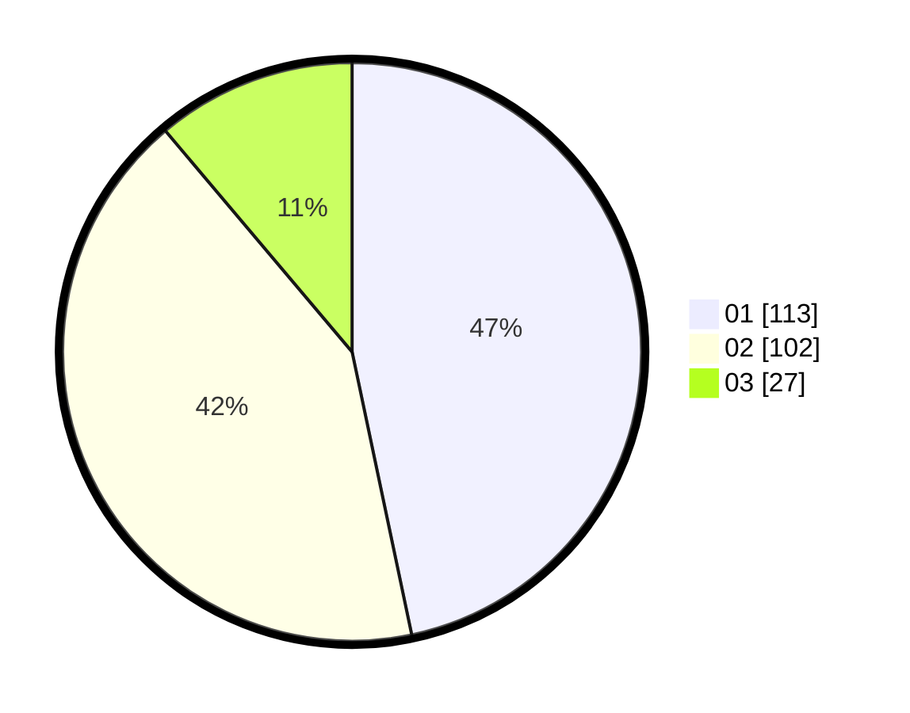

# Hasil

Hasil perolehan suara paslon dapat dilihat pada file paslon-01.txt, paslon-02.txt, dan paslon-03.txt.

Jika tidak ada, artinya data tersebut belum ada pada SIREKAP.

## Perolehan Suara

 * Paslon 01: **113**.
 * Paslon 02: **102**.
 * Paslon 03: **27**.

## Foto C Plano

https://sirekap-obj-formc.kpu.go.id/8ba1/pemilu/ppwp/31/75/09/10/02/3175091002167-20240214-192520--6c9b76a3-e1fd-4f19-b29b-c60172580395.jpg

https://sirekap-obj-formc.kpu.go.id/8ba1/pemilu/ppwp/31/75/09/10/02/3175091002167-20240214-184632--701917fe-95bd-4b45-acf0-8852695874d6.jpg

https://sirekap-obj-formc.kpu.go.id/8ba1/pemilu/ppwp/31/75/09/10/02/3175091002167-20240214-180651--51b7a59b-0923-49f3-ba14-adfe5ca251d5.jpg

## DATA PEMILIH TETAP

Jumlah pemilih dalam DPT: **282**.
 * L: **144**.
 * P: **138**.

## DATA PENGGUNA HAK PILIH

Jumlah pengguna hak pilih dalam DPT: **242**.
 * L: **114**.
 * P: **128**.

Jumlah pengguna hak pilih dalam DPTb: **3**.
 * L: **1**.
 * P: **2**.

Jumlah pengguna hak pilih dalam DPK: **1**.
 * L: **1**.
 * P: **0**.

Jumlah pengguna hak pilih: **246**.
 * L: **116**.
 * P: **130**.

## JUMLAH SUARA SAH DAN TIDAK SAH

JUMLAH SELURUH SUARA SAH: **242**.

JUMLAH SUARA TIDAK SAH: **4**.

JUMLAH SELURUH SUARA SAH DAN SUARA TIDAK SAH: **246**.
