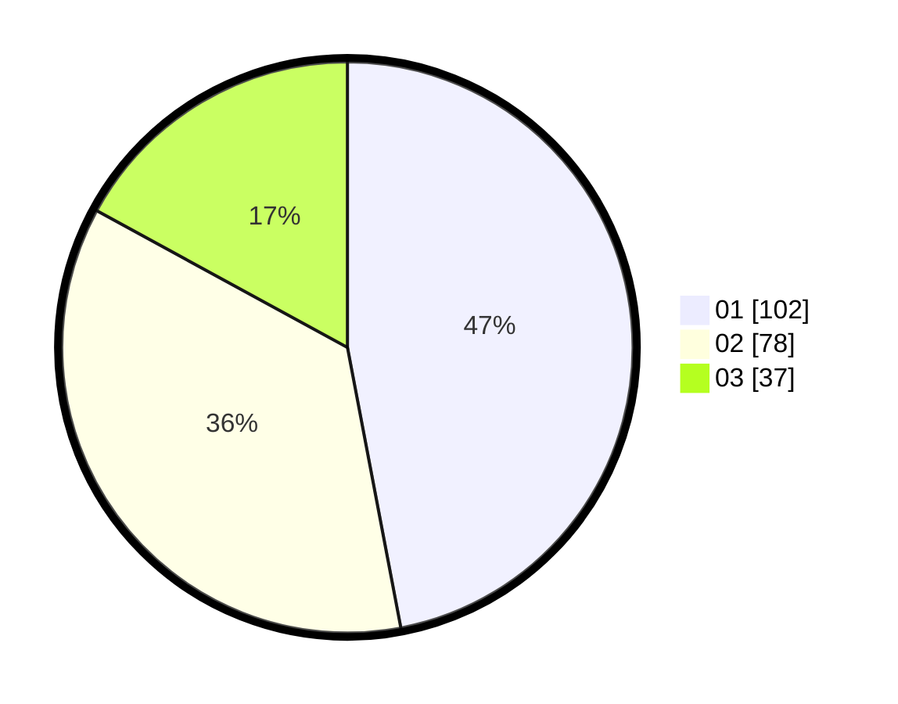

# Hasil

Hasil perolehan suara paslon dapat dilihat pada file paslon-01.txt, paslon-02.txt, dan paslon-03.txt.

Jika tidak ada, artinya data tersebut belum ada pada SIREKAP.

## Perolehan Suara

 * Paslon 01: **102**.
 * Paslon 02: **78**.
 * Paslon 03: **37**.

## Foto C Plano

https://sirekap-obj-formc.kpu.go.id/9692/pemilu/ppwp/31/75/09/10/02/3175091002169-20240214-192808--4ea08520-1274-4b85-a826-7f425d959638.jpg

https://sirekap-obj-formc.kpu.go.id/9692/pemilu/ppwp/31/75/09/10/02/3175091002169-20240214-192846--12f3fdce-161c-4001-b2d9-1e088b83f543.jpg

https://sirekap-obj-formc.kpu.go.id/9692/pemilu/ppwp/31/75/09/10/02/3175091002169-20240214-192917--06fb1814-49b3-4751-a419-bbf9efcb136a.jpg

## DATA PEMILIH TETAP

Jumlah pemilih dalam DPT: **217**.
 * L: **102**.
 * P: **115**.

## DATA PENGGUNA HAK PILIH

Jumlah pengguna hak pilih dalam DPT: **271**.
 * L: **134**.
 * P: **137**.

Jumlah pengguna hak pilih dalam DPTb: **0**.
 * L: **0**.
 * P: **0**.

Jumlah pengguna hak pilih dalam DPK: **0**.
 * L: **0**.
 * P: **0**.

Jumlah pengguna hak pilih: **271**.
 * L: **134**.
 * P: **137**.

## JUMLAH SUARA SAH DAN TIDAK SAH

JUMLAH SELURUH SUARA SAH: **217**.

JUMLAH SUARA TIDAK SAH: **0**.

JUMLAH SELURUH SUARA SAH DAN SUARA TIDAK SAH: **217**.
