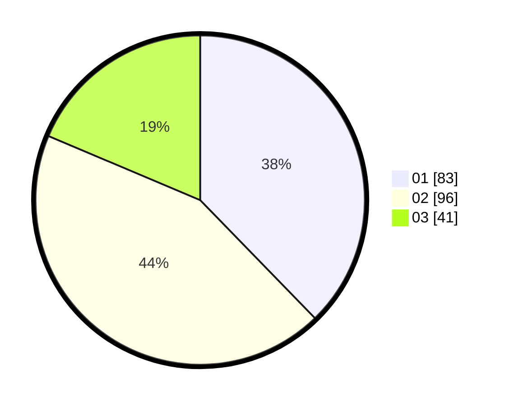

# Hasil

Hasil perolehan suara paslon dapat dilihat pada file paslon-01.txt, paslon-02.txt, dan paslon-03.txt.

Jika tidak ada, artinya data tersebut belum ada pada SIREKAP.

## Perolehan Suara

 * Paslon 01: **83**.
 * Paslon 02: **96**.
 * Paslon 03: **41**.

## Foto C Plano

https://sirekap-obj-formc.kpu.go.id/4578/pemilu/ppwp/31/75/09/10/02/3175091002172-20240214-210016--ac05d5ac-ad94-492a-8dad-689671f851e2.jpg

https://sirekap-obj-formc.kpu.go.id/4578/pemilu/ppwp/31/75/09/10/02/3175091002172-20240214-201242--f7a56264-e617-437d-be0d-4ef6338341d9.jpg

https://sirekap-obj-formc.kpu.go.id/4578/pemilu/ppwp/31/75/09/10/02/3175091002172-20240214-212402--220d820c-3e73-49c6-943c-41ebf4a65c24.jpg
