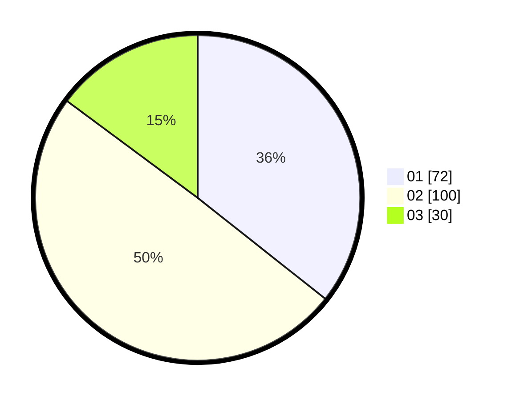

# Hasil

Hasil perolehan suara paslon dapat dilihat pada file paslon-01.txt, paslon-02.txt, dan paslon-03.txt.

Jika tidak ada, artinya data tersebut belum ada pada SIREKAP.

## Perolehan Suara

 * Paslon 01: **72**.
 * Paslon 02: **100**.
 * Paslon 03: **30**.

## Foto C Plano

https://sirekap-obj-formc.kpu.go.id/18f3/pemilu/ppwp/31/75/09/10/02/3175091002174-20240214-194933--562c48e1-a2ba-4231-8f15-5e9d0ae9a63b.jpg

https://sirekap-obj-formc.kpu.go.id/18f3/pemilu/ppwp/31/75/09/10/02/3175091002174-20240214-193941--702e57c1-3422-465a-8a02-de0fd0c62315.jpg

https://sirekap-obj-formc.kpu.go.id/18f3/pemilu/ppwp/31/75/09/10/02/3175091002174-20240214-155826--a643aa53-3cf4-4169-aef5-25c5cddadd72.jpg

## DATA PEMILIH TETAP

Jumlah pemilih dalam DPT: **245**.
 * L: **121**.
 * P: **124**.

## DATA PENGGUNA HAK PILIH

Jumlah pengguna hak pilih dalam DPT: **203**.
 * L: **98**.
 * P: **105**.

Jumlah pengguna hak pilih dalam DPTb: **0**.
 * L: **0**.
 * P: **0**.

Jumlah pengguna hak pilih dalam DPK: **3**.
 * L: **0**.
 * P: **3**.

Jumlah pengguna hak pilih: **206**.
 * L: **98**.
 * P: **108**.

## JUMLAH SUARA SAH DAN TIDAK SAH

JUMLAH SELURUH SUARA SAH: **202**.

JUMLAH SUARA TIDAK SAH: **4**.

JUMLAH SELURUH SUARA SAH DAN SUARA TIDAK SAH: **206**.
