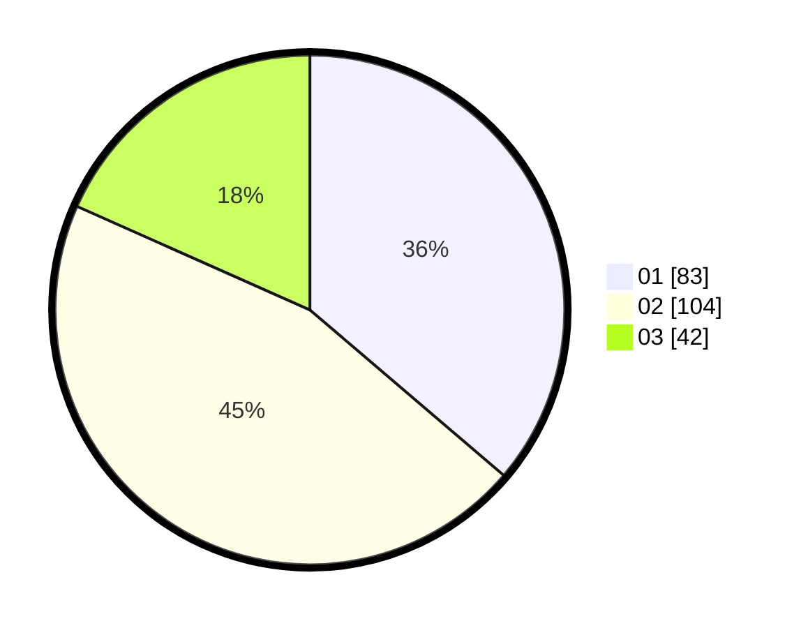

# Hasil

Hasil perolehan suara paslon dapat dilihat pada file paslon-01.txt, paslon-02.txt, dan paslon-03.txt.

Jika tidak ada, artinya data tersebut belum ada pada SIREKAP.

## Perolehan Suara

 * Paslon 01: **83**.
 * Paslon 02: **104**.
 * Paslon 03: **42**.

## Foto C Plano

https://sirekap-obj-formc.kpu.go.id/57ce/pemilu/ppwp/31/75/09/10/02/3175091002178-20240217-153959--a5d34ee1-92eb-4e26-9d1e-9aca5bfabf58.jpg

https://sirekap-obj-formc.kpu.go.id/57ce/pemilu/ppwp/31/75/09/10/02/3175091002178-20240217-153951--8616714d-702f-4b12-a1db-cb84906b467f.jpg

https://sirekap-obj-formc.kpu.go.id/57ce/pemilu/ppwp/31/75/09/10/02/3175091002178-20240217-153946--32e8ac4b-09fd-4e94-ad98-222a9583d3d7.jpg

## DATA PEMILIH TETAP

Jumlah pemilih dalam DPT: **286**.
 * L: **141**.
 * P: **145**.

## DATA PENGGUNA HAK PILIH

Jumlah pengguna hak pilih dalam DPT: **233**.
 * L: **110**.
 * P: **123**.

Jumlah pengguna hak pilih dalam DPTb: **0**.
 * L: **0**.
 * P: **0**.

Jumlah pengguna hak pilih dalam DPK: **2**.
 * L: **1**.
 * P: **1**.

Jumlah pengguna hak pilih: **235**.
 * L: **111**.
 * P: **124**.

## JUMLAH SUARA SAH DAN TIDAK SAH

JUMLAH SELURUH SUARA SAH: **229**.

JUMLAH SUARA TIDAK SAH: **6**.

JUMLAH SELURUH SUARA SAH DAN SUARA TIDAK SAH: **235**.
