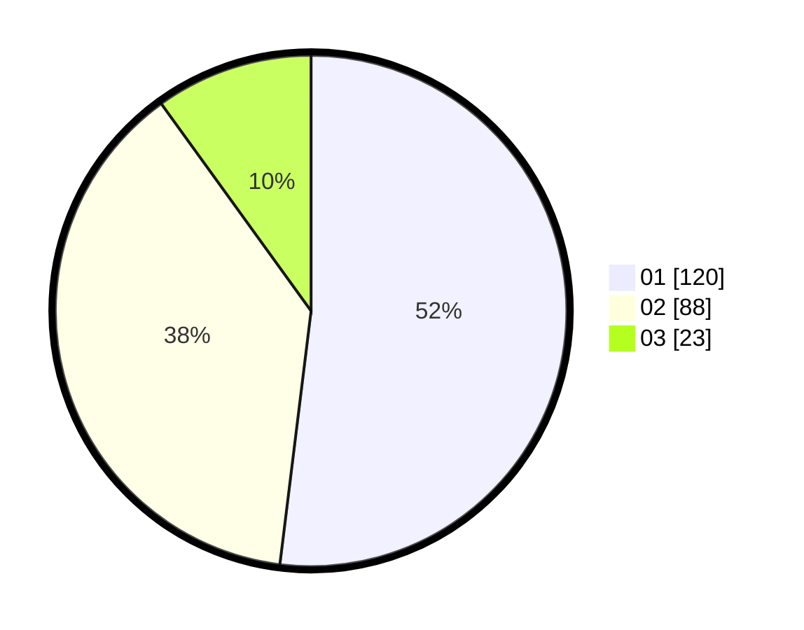

# Hasil

Hasil perolehan suara paslon dapat dilihat pada file paslon-01.txt, paslon-02.txt, dan paslon-03.txt.

Jika tidak ada, artinya data tersebut belum ada pada SIREKAP.

## Perolehan Suara

 * Paslon 01: **120**.
 * Paslon 02: **88**.
 * Paslon 03: **23**.

## Foto C Plano

https://sirekap-obj-formc.kpu.go.id/1ded/pemilu/ppwp/31/75/09/10/02/3175091002182-20240214-192233--3ed584d6-4332-483a-8dc1-db4055597614.jpg

https://sirekap-obj-formc.kpu.go.id/1ded/pemilu/ppwp/31/75/09/10/02/3175091002182-20240214-214659--3e90abf5-7ee9-4da3-9ea8-ed1517d95ed6.jpg

https://sirekap-obj-formc.kpu.go.id/1ded/pemilu/ppwp/31/75/09/10/02/3175091002182-20240214-192256--1e2c55ed-213f-4c8c-b14c-b71e2fade84c.jpg

## DATA PEMILIH TETAP

Jumlah pemilih dalam DPT: **247**.
 * L: **112**.
 * P: **135**.

## DATA PENGGUNA HAK PILIH

Jumlah pengguna hak pilih dalam DPT: **230**.
 * L: **103**.
 * P: **127**.

Jumlah pengguna hak pilih dalam DPTb: **2**.
 * L: **2**.
 * P: **0**.

Jumlah pengguna hak pilih dalam DPK: **0**.
 * L: **0**.
 * P: **0**.

Jumlah pengguna hak pilih: **232**.
 * L: **105**.
 * P: **127**.

## JUMLAH SUARA SAH DAN TIDAK SAH

JUMLAH SELURUH SUARA SAH: **231**.

JUMLAH SUARA TIDAK SAH: **1**.

JUMLAH SELURUH SUARA SAH DAN SUARA TIDAK SAH: **232**.
