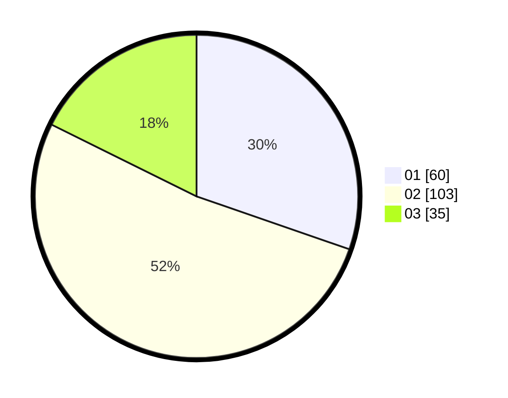

# Hasil

Hasil perolehan suara paslon dapat dilihat pada file paslon-01.txt, paslon-02.txt, dan paslon-03.txt.

Jika tidak ada, artinya data tersebut belum ada pada SIREKAP.

## Perolehan Suara

 * Paslon 01: **60**.
 * Paslon 02: **103**.
 * Paslon 03: **35**.

## Foto C Plano

https://sirekap-obj-formc.kpu.go.id/d825/pemilu/ppwp/31/75/09/10/02/3175091002184-20240214-192912--4a06bed0-0f94-4e91-bb5b-fb5022565438.jpg

https://sirekap-obj-formc.kpu.go.id/d825/pemilu/ppwp/31/75/09/10/02/3175091002184-20240214-192915--3a8f37af-e626-4356-88a0-ac836fb2fd8e.jpg

https://sirekap-obj-formc.kpu.go.id/d825/pemilu/ppwp/31/75/09/10/02/3175091002184-20240214-192918--2b02024c-0ddc-4bcb-bea1-57b65311bb58.jpg

## DATA PEMILIH TETAP

Jumlah pemilih dalam DPT: **257**.
 * L: **123**.
 * P: **134**.

## DATA PENGGUNA HAK PILIH

Jumlah pengguna hak pilih dalam DPT: **197**.
 * L: **90**.
 * P: **107**.

Jumlah pengguna hak pilih dalam DPTb: **1**.
 * L: **0**.
 * P: **1**.

Jumlah pengguna hak pilih dalam DPK: **2**.
 * L: **1**.
 * P: **1**.

Jumlah pengguna hak pilih: **200**.
 * L: **91**.
 * P: **109**.

## JUMLAH SUARA SAH DAN TIDAK SAH

JUMLAH SELURUH SUARA SAH: **198**.

JUMLAH SUARA TIDAK SAH: **2**.

JUMLAH SELURUH SUARA SAH DAN SUARA TIDAK SAH: **200**.
