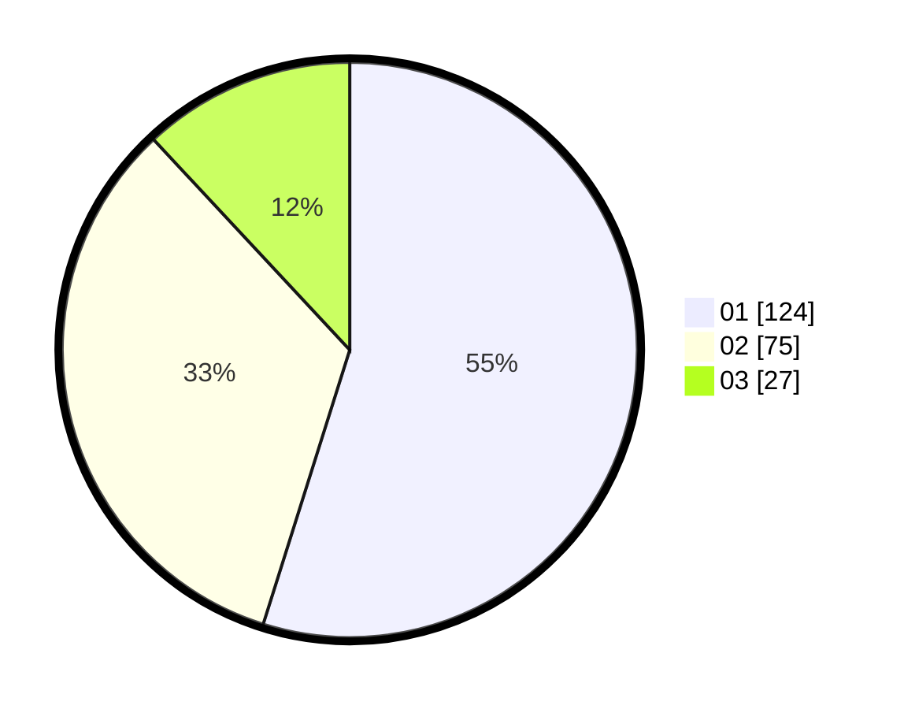

# Hasil

Hasil perolehan suara paslon dapat dilihat pada file paslon-01.txt, paslon-02.txt, dan paslon-03.txt.

Jika tidak ada, artinya data tersebut belum ada pada SIREKAP.

## Perolehan Suara

 * Paslon 01: **124**.
 * Paslon 02: **75**.
 * Paslon 03: **27**.

## Foto C Plano

https://sirekap-obj-formc.kpu.go.id/c115/pemilu/ppwp/31/75/09/10/02/3175091002189-20240214-190506--b0499a34-5d34-4971-9acf-bb7b7bb727f5.jpg

https://sirekap-obj-formc.kpu.go.id/c115/pemilu/ppwp/31/75/09/10/02/3175091002189-20240214-190534--88094a50-a4ec-49a1-a188-1516b2861c44.jpg

https://sirekap-obj-formc.kpu.go.id/c115/pemilu/ppwp/31/75/09/10/02/3175091002189-20240214-190543--0ce95ac5-44a9-4d90-81ee-d6d28caea361.jpg

## DATA PEMILIH TETAP

Jumlah pemilih dalam DPT: **262**.
 * L: **125**.
 * P: **137**.

## DATA PENGGUNA HAK PILIH

Jumlah pengguna hak pilih dalam DPT: **224**.
 * L: **103**.
 * P: **121**.

Jumlah pengguna hak pilih dalam DPTb: **3**.
 * L: **2**.
 * P: **1**.

Jumlah pengguna hak pilih dalam DPK: **1**.
 * L: **0**.
 * P: **1**.

Jumlah pengguna hak pilih: **228**.
 * L: **105**.
 * P: **123**.

## JUMLAH SUARA SAH DAN TIDAK SAH

JUMLAH SELURUH SUARA SAH: **226**.

JUMLAH SUARA TIDAK SAH: **2**.

JUMLAH SELURUH SUARA SAH DAN SUARA TIDAK SAH: **228**.
