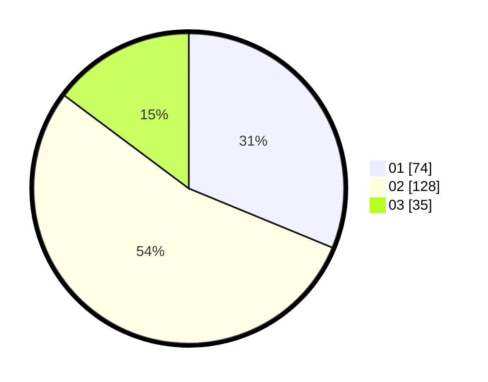

# Hasil

Hasil perolehan suara paslon dapat dilihat pada file paslon-01.txt, paslon-02.txt, dan paslon-03.txt.

Jika tidak ada, artinya data tersebut belum ada pada SIREKAP.

## Perolehan Suara

 * Paslon 01: **74**.
 * Paslon 02: **128**.
 * Paslon 03: **35**.

## Foto C Plano

https://sirekap-obj-formc.kpu.go.id/1e16/pemilu/ppwp/31/75/09/10/02/3175091002206-20240215-013042--1ca1a7ca-0723-4d67-8657-1efaa65ca2c6.jpg

https://sirekap-obj-formc.kpu.go.id/1e16/pemilu/ppwp/31/75/09/10/02/3175091002206-20240215-013147--3542caf9-b96c-4fb7-8157-c5bd947d29b3.jpg

https://sirekap-obj-formc.kpu.go.id/1e16/pemilu/ppwp/31/75/09/10/02/3175091002206-20240215-013242--9411d46a-219a-4893-acd6-5dc7c79368c8.jpg
