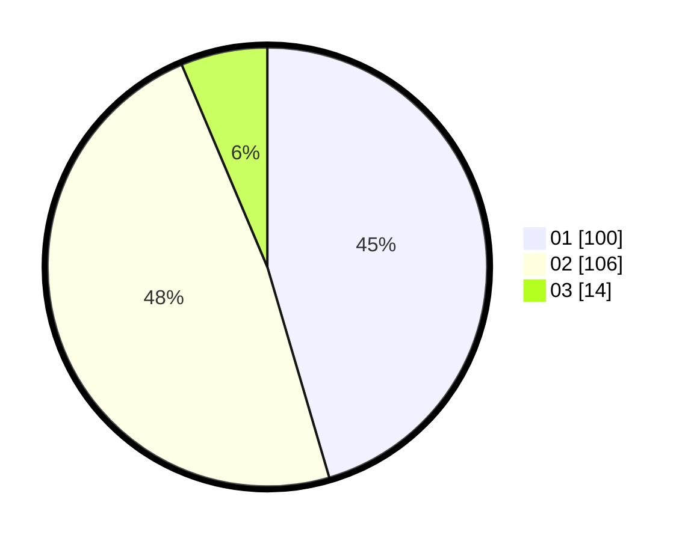

# Hasil

Hasil perolehan suara paslon dapat dilihat pada file paslon-01.txt, paslon-02.txt, dan paslon-03.txt.

Jika tidak ada, artinya data tersebut belum ada pada SIREKAP.

## Perolehan Suara

 * Paslon 01: **100**.
 * Paslon 02: **106**.
 * Paslon 03: **14**.

## Foto C Plano

https://sirekap-obj-formc.kpu.go.id/cdbc/pemilu/ppwp/31/75/09/10/02/3175091002209-20240214-192100--0a144d48-061b-4645-8931-24576d4747f5.jpg

https://sirekap-obj-formc.kpu.go.id/cdbc/pemilu/ppwp/31/75/09/10/02/3175091002209-20240214-192323--c5adf200-1290-45cd-81ac-f5961766bfea.jpg

https://sirekap-obj-formc.kpu.go.id/cdbc/pemilu/ppwp/31/75/09/10/02/3175091002209-20240214-192549--edf1266b-3b7f-4b3a-8b1c-d8c6c6aa7abc.jpg

## DATA PEMILIH TETAP

Jumlah pemilih dalam DPT: **257**.
 * L: **113**.
 * P: **144**.

## DATA PENGGUNA HAK PILIH

Jumlah pengguna hak pilih dalam DPT: **220**.
 * L: **96**.
 * P: **124**.

Jumlah pengguna hak pilih dalam DPTb: **2**.
 * L: **0**.
 * P: **2**.

Jumlah pengguna hak pilih dalam DPK: **1**.
 * L: **0**.
 * P: **1**.

Jumlah pengguna hak pilih: **223**.
 * L: **96**.
 * P: **127**.

## JUMLAH SUARA SAH DAN TIDAK SAH

JUMLAH SELURUH SUARA SAH: **220**.

JUMLAH SUARA TIDAK SAH: **3**.

JUMLAH SELURUH SUARA SAH DAN SUARA TIDAK SAH: **223**.
