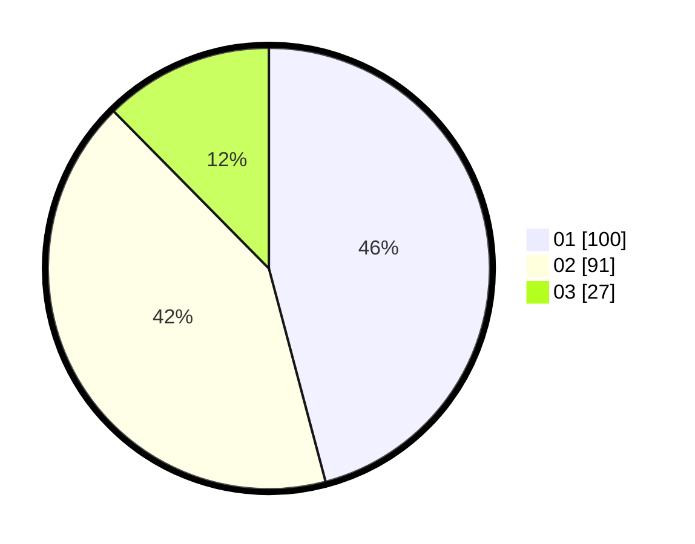

# Hasil

Hasil perolehan suara paslon dapat dilihat pada file paslon-01.txt, paslon-02.txt, dan paslon-03.txt.

Jika tidak ada, artinya data tersebut belum ada pada SIREKAP.

## Perolehan Suara

 * Paslon 01: **100**.
 * Paslon 02: **91**.
 * Paslon 03: **27**.

## Foto C Plano

https://sirekap-obj-formc.kpu.go.id/5136/pemilu/ppwp/31/75/09/10/03/3175091003001-20240214-191626--c71786ab-8930-43f0-a7fd-6f321eebd15d.jpg

https://sirekap-obj-formc.kpu.go.id/5136/pemilu/ppwp/31/75/09/10/03/3175091003001-20240214-191740--4812f9ff-2331-44e7-bd9c-715ed7ae4dd7.jpg

https://sirekap-obj-formc.kpu.go.id/5136/pemilu/ppwp/31/75/09/10/03/3175091003001-20240214-193024--2edb538b-105a-4c96-b964-93d6e57c5422.jpg

## DATA PEMILIH TETAP

Jumlah pemilih dalam DPT: **266**.
 * L: **134**.
 * P: **132**.

## DATA PENGGUNA HAK PILIH

Jumlah pengguna hak pilih dalam DPT: **266**.
 * L: **134**.
 * P: **132**.

Jumlah pengguna hak pilih dalam DPTb: **5**.
 * L: **0**.
 * P: **5**.

Jumlah pengguna hak pilih dalam DPK: **1**.
 * L: **0**.
 * P: **1**.

Jumlah pengguna hak pilih: **272**.
 * L: **134**.
 * P: **138**.

## JUMLAH SUARA SAH DAN TIDAK SAH

JUMLAH SELURUH SUARA SAH: **218**.

JUMLAH SUARA TIDAK SAH: **7**.

JUMLAH SELURUH SUARA SAH DAN SUARA TIDAK SAH: **225**.
