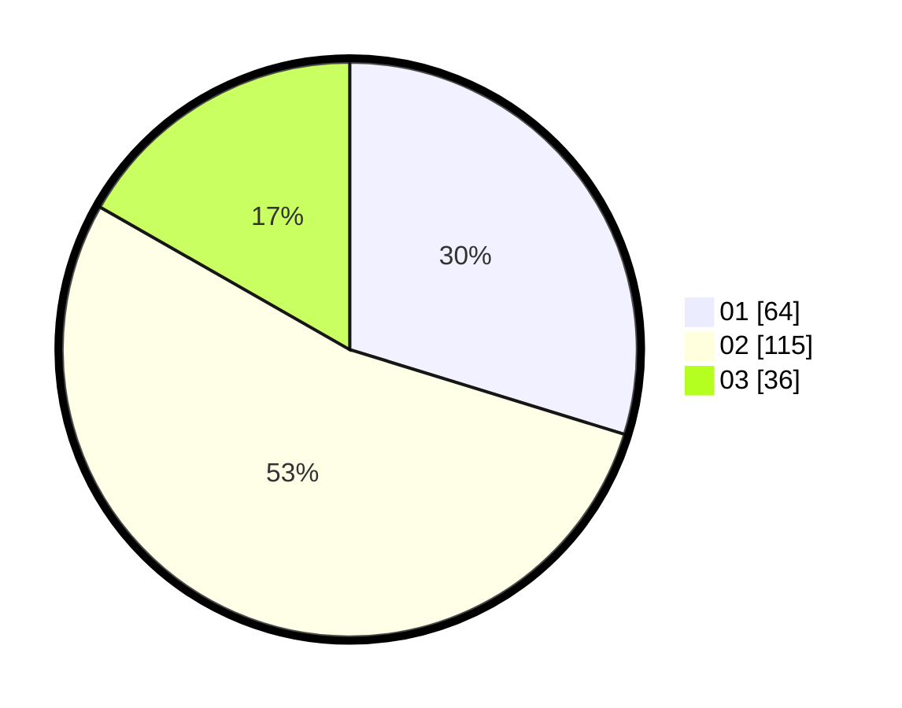

# Hasil

Hasil perolehan suara paslon dapat dilihat pada file paslon-01.txt, paslon-02.txt, dan paslon-03.txt.

Jika tidak ada, artinya data tersebut belum ada pada SIREKAP.

## Perolehan Suara

 * Paslon 01: **64**.
 * Paslon 02: **115**.
 * Paslon 03: **36**.

## Foto C Plano

https://sirekap-obj-formc.kpu.go.id/bab5/pemilu/ppwp/31/75/09/10/03/3175091003003-20240214-234342--5263d047-40b2-4bcd-ae50-700438ad8c39.jpg

https://sirekap-obj-formc.kpu.go.id/bab5/pemilu/ppwp/31/75/09/10/03/3175091003003-20240215-220515--ffb0cd12-e2ea-4da8-af03-db5f039f482b.jpg

https://sirekap-obj-formc.kpu.go.id/bab5/pemilu/ppwp/31/75/09/10/03/3175091003003-20240216-141902--507f53f4-21b5-4b66-a6bb-99eaf4139ed6.jpg

## DATA PEMILIH TETAP

Jumlah pemilih dalam DPT: **267**.
 * L: **136**.
 * P: **131**.

## DATA PENGGUNA HAK PILIH

Jumlah pengguna hak pilih dalam DPT: **217**.
 * L: **108**.
 * P: **109**.

Jumlah pengguna hak pilih dalam DPTb: **0**.
 * L: **0**.
 * P: **0**.

Jumlah pengguna hak pilih dalam DPK: **4**.
 * L: **2**.
 * P: **2**.

Jumlah pengguna hak pilih: **221**.
 * L: **110**.
 * P: **111**.

## JUMLAH SUARA SAH DAN TIDAK SAH

JUMLAH SELURUH SUARA SAH: **215**.

JUMLAH SUARA TIDAK SAH: **6**.

JUMLAH SELURUH SUARA SAH DAN SUARA TIDAK SAH: **221**.
