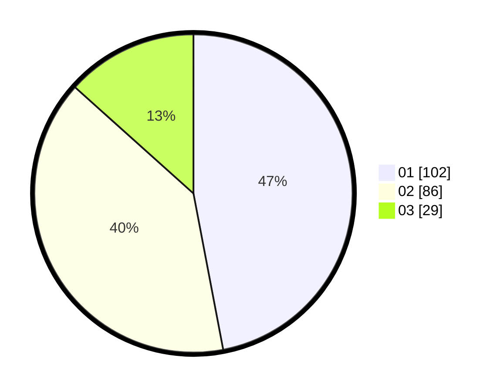

# Hasil

Hasil perolehan suara paslon dapat dilihat pada file paslon-01.txt, paslon-02.txt, dan paslon-03.txt.

Jika tidak ada, artinya data tersebut belum ada pada SIREKAP.

## Perolehan Suara

 * Paslon 01: **102**.
 * Paslon 02: **86**.
 * Paslon 03: **29**.

## Foto C Plano

https://sirekap-obj-formc.kpu.go.id/91b8/pemilu/ppwp/31/75/09/10/03/3175091003026-20240215-113948--772e41cf-df05-4a11-a439-c5fb40298931.jpg

https://sirekap-obj-formc.kpu.go.id/91b8/pemilu/ppwp/31/75/09/10/03/3175091003026-20240215-113954--f42c3a31-55dc-44e9-89c4-b24ec96ebc54.jpg

https://sirekap-obj-formc.kpu.go.id/91b8/pemilu/ppwp/31/75/09/10/03/3175091003026-20240215-113959--9350ff1e-f40d-4c61-ac24-31c967fc5be6.jpg

## DATA PEMILIH TETAP

Jumlah pemilih dalam DPT: **282**.
 * L: **131**.
 * P: **151**.

## DATA PENGGUNA HAK PILIH

Jumlah pengguna hak pilih dalam DPT: **219**.
 * L: **97**.
 * P: **122**.

Jumlah pengguna hak pilih dalam DPTb: **0**.
 * L: **0**.
 * P: **0**.

Jumlah pengguna hak pilih dalam DPK: **5**.
 * L: **4**.
 * P: **1**.

Jumlah pengguna hak pilih: **224**.
 * L: **101**.
 * P: **123**.

## JUMLAH SUARA SAH DAN TIDAK SAH

JUMLAH SELURUH SUARA SAH: **217**.

JUMLAH SUARA TIDAK SAH: **7**.

JUMLAH SELURUH SUARA SAH DAN SUARA TIDAK SAH: **224**.
