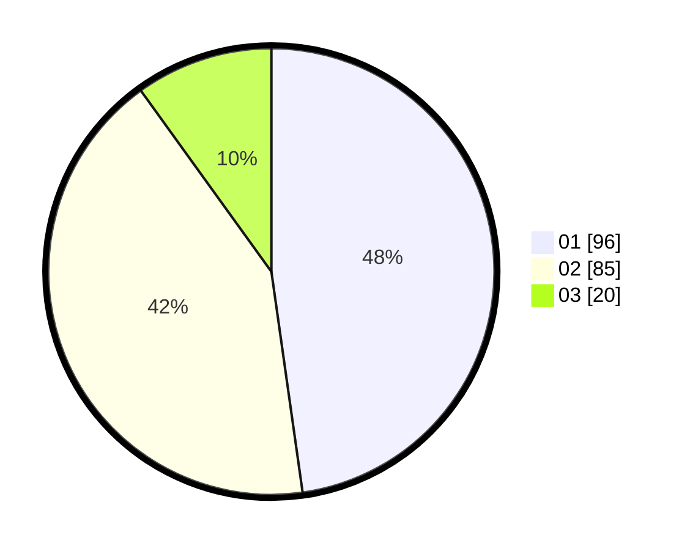

# Hasil

Hasil perolehan suara paslon dapat dilihat pada file paslon-01.txt, paslon-02.txt, dan paslon-03.txt.

Jika tidak ada, artinya data tersebut belum ada pada SIREKAP.

## Perolehan Suara

 * Paslon 01: **96**.
 * Paslon 02: **85**.
 * Paslon 03: **20**.

## Foto C Plano

https://sirekap-obj-formc.kpu.go.id/ee0d/pemilu/ppwp/31/75/09/10/03/3175091003039-20240214-185930--ce83217d-623b-4bf8-aec4-243c0d12ddef.jpg

https://sirekap-obj-formc.kpu.go.id/ee0d/pemilu/ppwp/31/75/09/10/03/3175091003039-20240214-160115--30f495ce-6be7-4701-bfe0-f19ddc6e1231.jpg

https://sirekap-obj-formc.kpu.go.id/ee0d/pemilu/ppwp/31/75/09/10/03/3175091003039-20240214-155826--4d5c6d92-debb-4cb8-80c4-6130a808d3fa.jpg

## DATA PEMILIH TETAP

Jumlah pemilih dalam DPT: **250**.
 * L: **92**.
 * P: **158**.

## DATA PENGGUNA HAK PILIH

Jumlah pengguna hak pilih dalam DPT: **191**.
 * L: **67**.
 * P: **124**.

Jumlah pengguna hak pilih dalam DPTb: **5**.
 * L: **2**.
 * P: **3**.

Jumlah pengguna hak pilih dalam DPK: **5**.
 * L: **1**.
 * P: **4**.

Jumlah pengguna hak pilih: **201**.
 * L: **70**.
 * P: **131**.

## JUMLAH SUARA SAH DAN TIDAK SAH

JUMLAH SELURUH SUARA SAH: **201**.

JUMLAH SUARA TIDAK SAH: **0**.

JUMLAH SELURUH SUARA SAH DAN SUARA TIDAK SAH: **201**.
