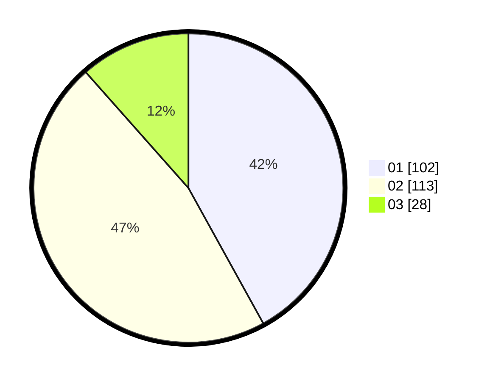

# Hasil

Hasil perolehan suara paslon dapat dilihat pada file paslon-01.txt, paslon-02.txt, dan paslon-03.txt.

Jika tidak ada, artinya data tersebut belum ada pada SIREKAP.

## Perolehan Suara

 * Paslon 01: **102**.
 * Paslon 02: **113**.
 * Paslon 03: **28**.

## Foto C Plano

https://sirekap-obj-formc.kpu.go.id/3cb6/pemilu/ppwp/31/75/09/10/03/3175091003045-20240214-230802--46b916af-c4e3-4ab3-9804-3a381d18629d.jpg

https://sirekap-obj-formc.kpu.go.id/3cb6/pemilu/ppwp/31/75/09/10/03/3175091003045-20240214-231011--016a0097-f1db-4290-8156-f554de2ce4a2.jpg

https://sirekap-obj-formc.kpu.go.id/3cb6/pemilu/ppwp/31/75/09/10/03/3175091003045-20240214-231156--cda22ca0-0908-4fa7-b43b-7fad4b71741e.jpg
