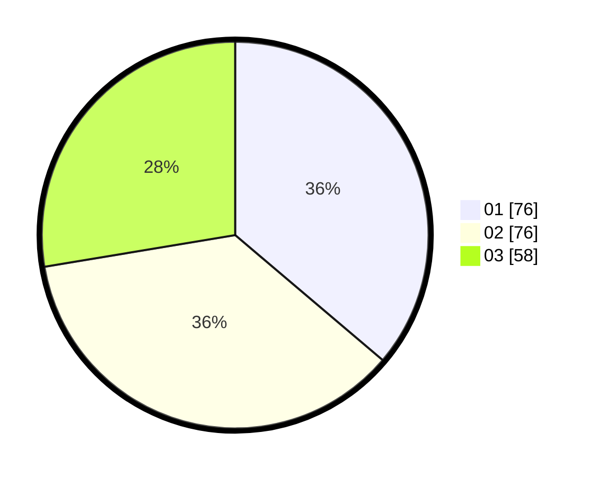

# Hasil

Hasil perolehan suara paslon dapat dilihat pada file paslon-01.txt, paslon-02.txt, dan paslon-03.txt.

Jika tidak ada, artinya data tersebut belum ada pada SIREKAP.

## Perolehan Suara

 * Paslon 01: **76**.
 * Paslon 02: **76**.
 * Paslon 03: **58**.

## Foto C Plano

https://sirekap-obj-formc.kpu.go.id/fd69/pemilu/ppwp/31/75/09/10/03/3175091003053-20240214-232827--56b9fe7f-0d42-494a-ae90-98664625fbc2.jpg

https://sirekap-obj-formc.kpu.go.id/fd69/pemilu/ppwp/31/75/09/10/03/3175091003053-20240214-232945--974c368c-0229-474a-a08f-1400971b6cde.jpg

https://sirekap-obj-formc.kpu.go.id/fd69/pemilu/ppwp/31/75/09/10/03/3175091003053-20240214-233114--06fa2bed-2c08-4fda-97d2-9a5faf8a65cf.jpg
