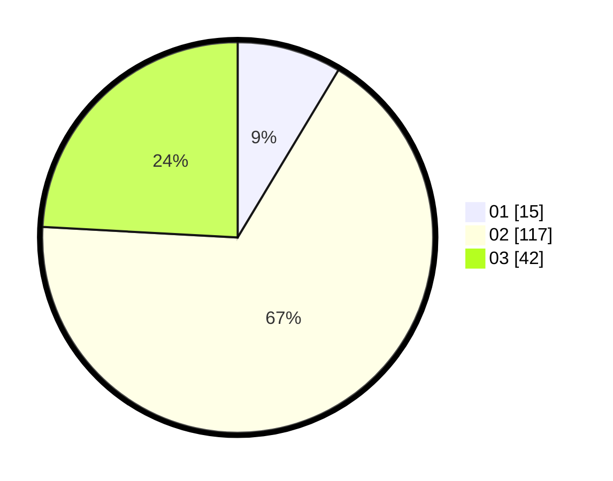

# Hasil

Hasil perolehan suara paslon dapat dilihat pada file paslon-01.txt, paslon-02.txt, dan paslon-03.txt.

Jika tidak ada, artinya data tersebut belum ada pada SIREKAP.

## Perolehan Suara

 * Paslon 01: **15**.
 * Paslon 02: **117**.
 * Paslon 03: **42**.

## Foto C Plano

https://sirekap-obj-formc.kpu.go.id/e287/pemilu/ppwp/31/75/09/10/03/3175091003063-20240214-184805--b75fe112-3843-4776-b364-54a250a3ecd7.jpg

https://sirekap-obj-formc.kpu.go.id/e287/pemilu/ppwp/31/75/09/10/03/3175091003063-20240214-190150--74145335-33ed-4246-9d0d-f475869221b0.jpg

https://sirekap-obj-formc.kpu.go.id/e287/pemilu/ppwp/31/75/09/10/03/3175091003063-20240214-190411--d3e67a48-400c-4e65-960c-7c9d0eebc1c5.jpg

## DATA PEMILIH TETAP

Jumlah pemilih dalam DPT: **267**.
 * L: **132**.
 * P: **135**.

## DATA PENGGUNA HAK PILIH

Jumlah pengguna hak pilih dalam DPT: **172**.
 * L: **75**.
 * P: **97**.

Jumlah pengguna hak pilih dalam DPTb: **2**.
 * L: **1**.
 * P: **1**.

Jumlah pengguna hak pilih dalam DPK: **2**.
 * L: **0**.
 * P: **2**.

Jumlah pengguna hak pilih: **176**.
 * L: **76**.
 * P: **100**.

## JUMLAH SUARA SAH DAN TIDAK SAH

JUMLAH SELURUH SUARA SAH: **174**.

JUMLAH SUARA TIDAK SAH: **2**.

JUMLAH SELURUH SUARA SAH DAN SUARA TIDAK SAH: **176**.
