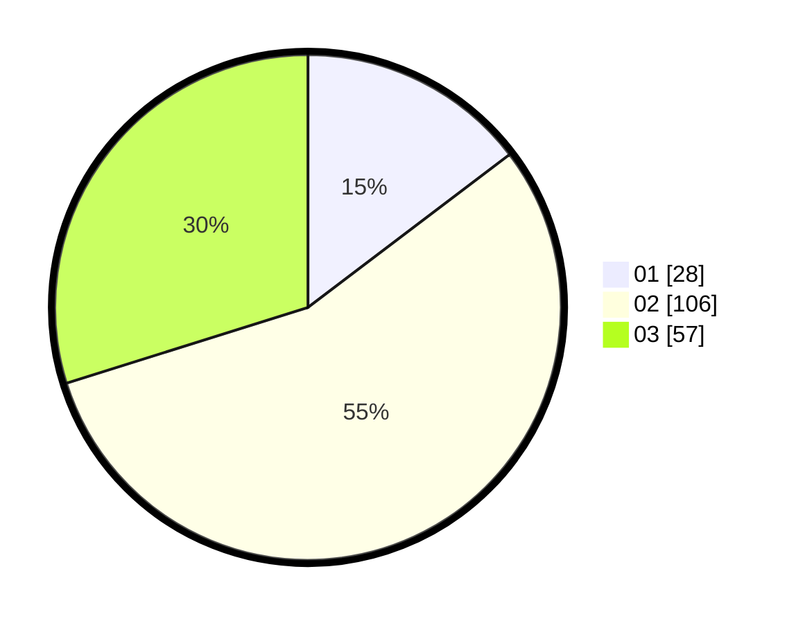

# Hasil

Hasil perolehan suara paslon dapat dilihat pada file paslon-01.txt, paslon-02.txt, dan paslon-03.txt.

Jika tidak ada, artinya data tersebut belum ada pada SIREKAP.

## Perolehan Suara

 * Paslon 01: **28**.
 * Paslon 02: **106**.
 * Paslon 03: **57**.

## Foto C Plano

https://sirekap-obj-formc.kpu.go.id/e266/pemilu/ppwp/31/75/09/10/03/3175091003065-20240215-000045--c4facae1-8946-4c0b-bfcc-18a6ff7053d1.jpg

https://sirekap-obj-formc.kpu.go.id/e266/pemilu/ppwp/31/75/09/10/03/3175091003065-20240215-000104--80749745-3802-4210-8c50-3e68f0ff5990.jpg

https://sirekap-obj-formc.kpu.go.id/e266/pemilu/ppwp/31/75/09/10/03/3175091003065-20240215-000112--62ea3c8a-8bac-4c56-b5da-993c21b81cdb.jpg

## DATA PEMILIH TETAP

Jumlah pemilih dalam DPT: **250**.
 * L: **121**.
 * P: **129**.

## DATA PENGGUNA HAK PILIH

Jumlah pengguna hak pilih dalam DPT: **188**.
 * L: **85**.
 * P: **103**.

Jumlah pengguna hak pilih dalam DPTb: **0**.
 * L: **0**.
 * P: **0**.

Jumlah pengguna hak pilih dalam DPK: **4**.
 * L: **3**.
 * P: **1**.

Jumlah pengguna hak pilih: **192**.
 * L: **88**.
 * P: **104**.

## JUMLAH SUARA SAH DAN TIDAK SAH

JUMLAH SELURUH SUARA SAH: **191**.

JUMLAH SUARA TIDAK SAH: **1**.

JUMLAH SELURUH SUARA SAH DAN SUARA TIDAK SAH: **192**.
