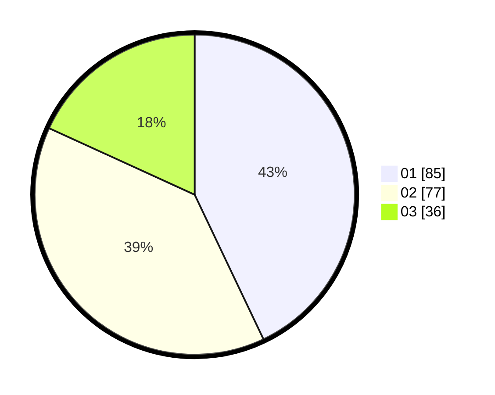

# Hasil

Hasil perolehan suara paslon dapat dilihat pada file paslon-01.txt, paslon-02.txt, dan paslon-03.txt.

Jika tidak ada, artinya data tersebut belum ada pada SIREKAP.

## Perolehan Suara

 * Paslon 01: **85**.
 * Paslon 02: **77**.
 * Paslon 03: **36**.

## Foto C Plano

https://sirekap-obj-formc.kpu.go.id/73fd/pemilu/ppwp/31/75/09/10/03/3175091003078-20240214-155432--224a97d6-2bac-4996-aa65-e8ee8a9a895a.jpg

https://sirekap-obj-formc.kpu.go.id/73fd/pemilu/ppwp/31/75/09/10/03/3175091003078-20240214-155448--8831c6d4-89bf-4e69-9486-2ff89608abc4.jpg

https://sirekap-obj-formc.kpu.go.id/73fd/pemilu/ppwp/31/75/09/10/03/3175091003078-20240214-155503--0ce3c706-0672-4051-9f68-c4de64eb0934.jpg

## DATA PEMILIH TETAP

Jumlah pemilih dalam DPT: **248**.
 * L: **120**.
 * P: **128**.

## DATA PENGGUNA HAK PILIH

Jumlah pengguna hak pilih dalam DPT: **191**.
 * L: **87**.
 * P: **104**.

Jumlah pengguna hak pilih dalam DPTb: **6**.
 * L: **4**.
 * P: **2**.

Jumlah pengguna hak pilih dalam DPK: **4**.
 * L: **2**.
 * P: **2**.

Jumlah pengguna hak pilih: **201**.
 * L: **93**.
 * P: **108**.

## JUMLAH SUARA SAH DAN TIDAK SAH

JUMLAH SELURUH SUARA SAH: **198**.

JUMLAH SUARA TIDAK SAH: **3**.

JUMLAH SELURUH SUARA SAH DAN SUARA TIDAK SAH: **201**.
