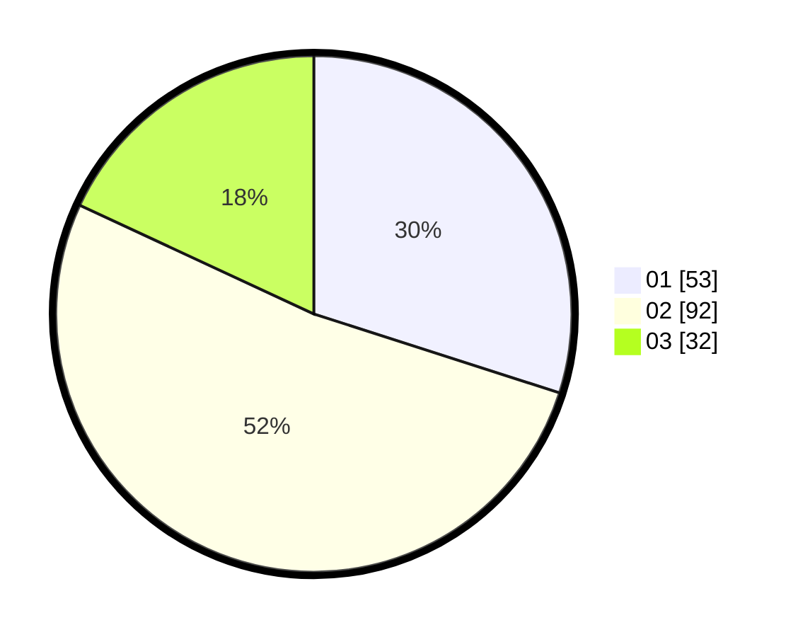

# Hasil

Hasil perolehan suara paslon dapat dilihat pada file paslon-01.txt, paslon-02.txt, dan paslon-03.txt.

Jika tidak ada, artinya data tersebut belum ada pada SIREKAP.

## Perolehan Suara

 * Paslon 01: **53**.
 * Paslon 02: **92**.
 * Paslon 03: **32**.

## Foto C Plano

https://sirekap-obj-formc.kpu.go.id/5ec9/pemilu/ppwp/31/75/09/10/03/3175091003083-20240214-223621--1a28be25-bcc1-46ab-a4c6-36cbc41b5de7.jpg

https://sirekap-obj-formc.kpu.go.id/5ec9/pemilu/ppwp/31/75/09/10/03/3175091003083-20240214-222414--6cd51f9c-bac5-48f2-8f0c-63b0606e7e24.jpg

https://sirekap-obj-formc.kpu.go.id/5ec9/pemilu/ppwp/31/75/09/10/03/3175091003083-20240214-223718--7989da5c-ffcb-4165-b47e-419dd72f8ff6.jpg
