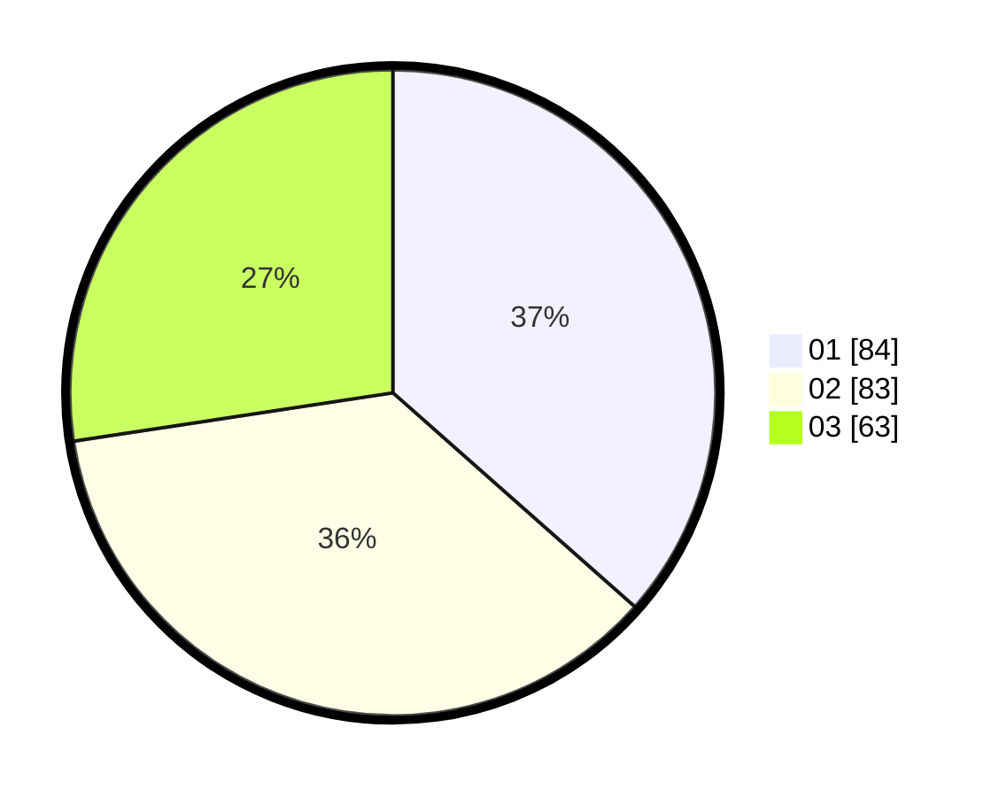

# Hasil

Hasil perolehan suara paslon dapat dilihat pada file paslon-01.txt, paslon-02.txt, dan paslon-03.txt.

Jika tidak ada, artinya data tersebut belum ada pada SIREKAP.

## Perolehan Suara

 * Paslon 01: **84**.
 * Paslon 02: **83**.
 * Paslon 03: **63**.

## Foto C Plano

https://sirekap-obj-formc.kpu.go.id/b131/pemilu/ppwp/31/75/09/10/03/3175091003086-20240216-132017--d7000c12-d080-4bc2-99f8-38165b3ca47c.jpg

https://sirekap-obj-formc.kpu.go.id/b131/pemilu/ppwp/31/75/09/10/03/3175091003086-20240216-132019--02c965e5-53d1-412d-a39d-ee7b25817937.jpg

https://sirekap-obj-formc.kpu.go.id/b131/pemilu/ppwp/31/75/09/10/03/3175091003086-20240216-132018--1ea64734-cf67-4b62-870c-ded0f15144c4.jpg

## DATA PEMILIH TETAP

Jumlah pemilih dalam DPT: **270**.
 * L: **130**.
 * P: **140**.

## DATA PENGGUNA HAK PILIH

Jumlah pengguna hak pilih dalam DPT: **233**.
 * L: **109**.
 * P: **124**.

Jumlah pengguna hak pilih dalam DPTb: **2**.
 * L: **1**.
 * P: **1**.

Jumlah pengguna hak pilih dalam DPK: **0**.
 * L: **0**.
 * P: **0**.

Jumlah pengguna hak pilih: **235**.
 * L: **110**.
 * P: **125**.

## JUMLAH SUARA SAH DAN TIDAK SAH

JUMLAH SELURUH SUARA SAH: **230**.

JUMLAH SUARA TIDAK SAH: **5**.

JUMLAH SELURUH SUARA SAH DAN SUARA TIDAK SAH: **235**.
