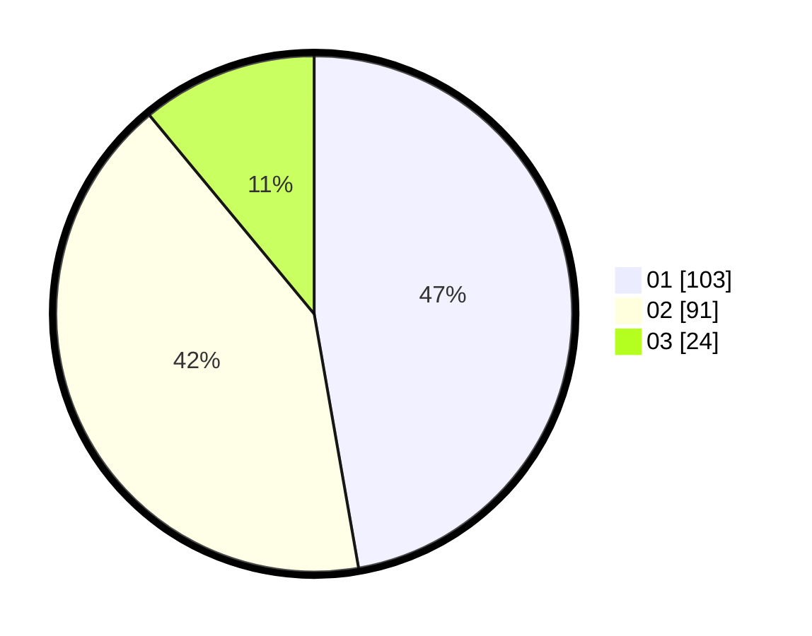

# Hasil

Hasil perolehan suara paslon dapat dilihat pada file paslon-01.txt, paslon-02.txt, dan paslon-03.txt.

Jika tidak ada, artinya data tersebut belum ada pada SIREKAP.

## Perolehan Suara

 * Paslon 01: **103**.
 * Paslon 02: **91**.
 * Paslon 03: **24**.

## Foto C Plano

https://sirekap-obj-formc.kpu.go.id/60e5/pemilu/ppwp/31/75/09/10/03/3175091003092-20240214-155131--8ab2fa7a-ade5-48f1-b910-6a7f326bfc68.jpg

https://sirekap-obj-formc.kpu.go.id/60e5/pemilu/ppwp/31/75/09/10/03/3175091003092-20240214-155504--707e2305-5af0-4287-83ab-1e4f9c59645b.jpg

https://sirekap-obj-formc.kpu.go.id/60e5/pemilu/ppwp/31/75/09/10/03/3175091003092-20240214-155107--a421d243-fdb6-4d52-856d-d9557bfe8e16.jpg

## DATA PEMILIH TETAP

Jumlah pemilih dalam DPT: **272**.
 * L: **134**.
 * P: **138**.

## DATA PENGGUNA HAK PILIH

Jumlah pengguna hak pilih dalam DPT: **220**.
 * L: **101**.
 * P: **119**.

Jumlah pengguna hak pilih dalam DPTb: **0**.
 * L: **0**.
 * P: **0**.

Jumlah pengguna hak pilih dalam DPK: **1**.
 * L: **0**.
 * P: **1**.

Jumlah pengguna hak pilih: **221**.
 * L: **101**.
 * P: **120**.

## JUMLAH SUARA SAH DAN TIDAK SAH

JUMLAH SELURUH SUARA SAH: **218**.

JUMLAH SUARA TIDAK SAH: **3**.

JUMLAH SELURUH SUARA SAH DAN SUARA TIDAK SAH: **221**.
