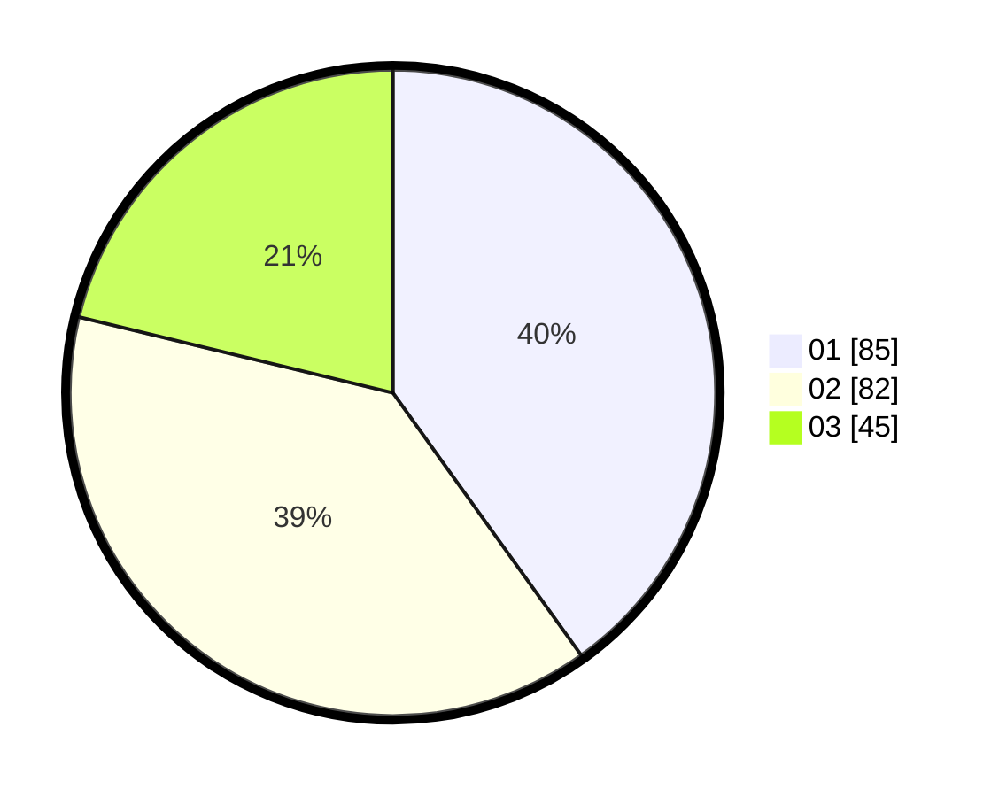

# Hasil

Hasil perolehan suara paslon dapat dilihat pada file paslon-01.txt, paslon-02.txt, dan paslon-03.txt.

Jika tidak ada, artinya data tersebut belum ada pada SIREKAP.

## Perolehan Suara

 * Paslon 01: **85**.
 * Paslon 02: **82**.
 * Paslon 03: **45**.

## Foto C Plano

https://sirekap-obj-formc.kpu.go.id/b011/pemilu/ppwp/31/75/09/10/03/3175091003095-20240215-182234--37536e53-e5aa-41f3-b507-73aa2cbfd9d3.jpg

https://sirekap-obj-formc.kpu.go.id/b011/pemilu/ppwp/31/75/09/10/03/3175091003095-20240215-182330--21525e12-9da4-4502-b856-c3e60ee145da.jpg

https://sirekap-obj-formc.kpu.go.id/b011/pemilu/ppwp/31/75/09/10/03/3175091003095-20240215-170327--f6fdf9cb-7e5f-4080-9aae-c5da0fc9447b.jpg
